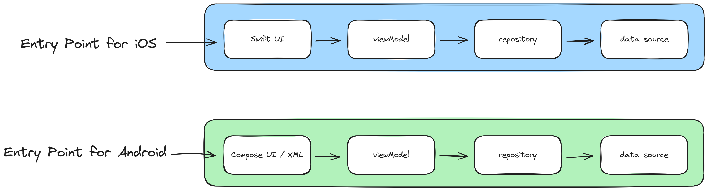
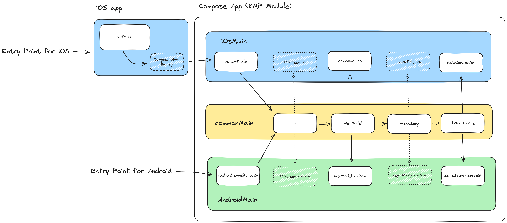
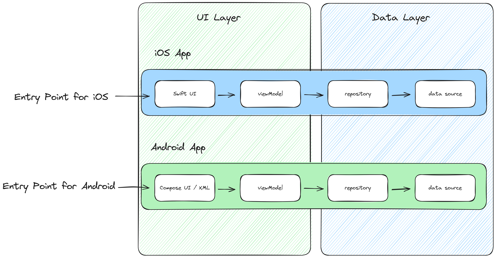
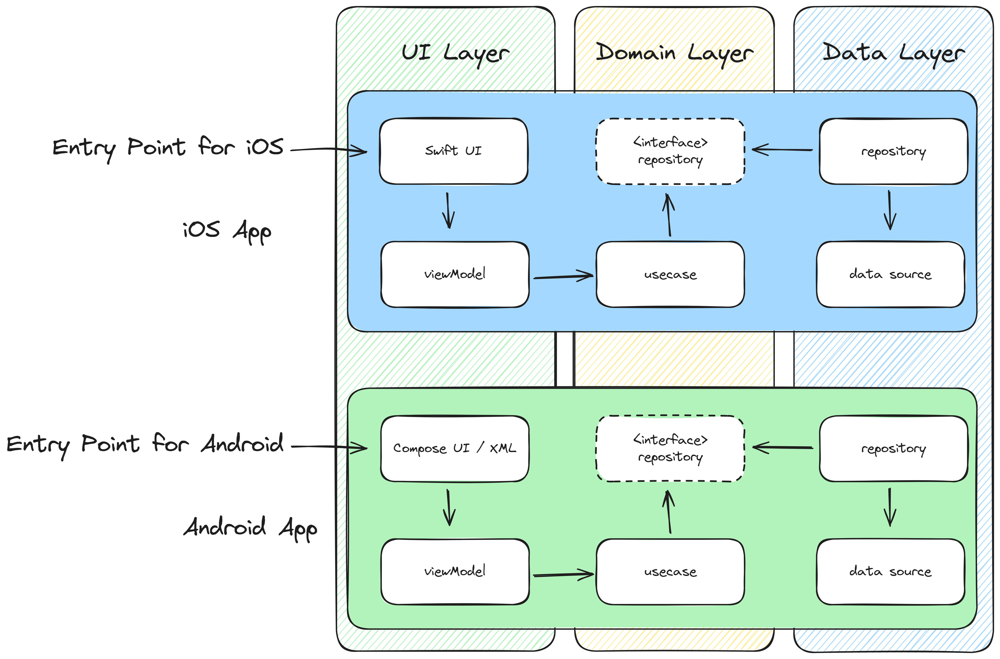

# kmp-sample-diagrams

These diagrams provide a visual representation of how Kotlin Multiplatform (KMP) can be integrated into existing projects, showcasing various architecture approaches and modular designs.

# I. Adding KMP

## 1. Normal Approach

This diagram illustrates the traditional development method where iOS and Android applications are developed separately without shared code.

## 2-1. KMP - Native UI

This diagram demonstrates using Kotlin Multiplatform without altering the native implementation of the UI screens on both iOS and Android platforms. The UI remains platform-specific, while other components can be shared.

## 2-2. KMP - Compose Multiplatform

This approach combines Kotlin Multiplatform and Compose Multiplatform to enable the reuse of UI components across both Android and iOS, allowing for a unified design system.

## 3. Main with UI and Data Layer

This diagram shows the separation of concerns by dividing the project into two distinct layers: UI and Data Layer. This layered structure facilitates easier refactoring of specific layers when needed.

## 4. KMP - Data Layer

In this example, Kotlin Multiplatform is applied specifically in the Data Layer, enabling code sharing for data handling across platforms while keeping platform-specific UI separate.

## 5. KMP - Presentation Layer

Here, Kotlin Multiplatform is utilized in the Presentation Layer, which includes the ViewModel and UI components.

## 6. KMP - UI Layer

This diagram showcases Kotlin Multiplatform applied to the UI Layer only, using Compose Multiplatform. The UI is shared between platforms, while other layers may remain platform-specific.

## 7. KMP - Presentation and Data Layer

This approach shows Kotlin Multiplatform applied to both the Presentation and Data Layers, enabling code sharing in business logic, data handling, and ViewModel implementation, and the UI.

# II. Adding KMP in Multiple Modules

## 1. Main Modular Approach

This diagram illustrates a traditional modular architecture where the project is divided into separate feature modules, such as Feature 1 and Feature 2. 
Each feature contains multiple layers (UI, Presentation, Data), but Kotlin Multiplatform (KMP) is not yet applied. This is the baseline structure before KMP integration.

## 2. KMP - Data Layer (Modular)

In this approach, Kotlin Multiplatform is introduced to Feature 2, specifically within the Data Layer. 
By sharing data-related code between platforms, the Data Layer becomes reusable across iOS and Android, while the other layers in Feature 2 remain platform-specific.

## 3. KMP - Presentation Layer (Modular)

In this approach, Kotlin Multiplatform is introduced into the entire Presentation Layer of Feature 2. 
This means both the UI and the presentation logic (ViewModel, controllers) are shared across platforms, while the Data Layer remains platform-specific.

## 4. KMP - UI Layer (Modular)

Here, Kotlin Multiplatform is applied solely to the UI components of Feature 2, using Compose Multiplatform. 
The presentation logic (ViewModel) and Data Layer remain platform-specific, while UI components are shared across platforms.

## 5. KMP - UI and Data Layer (Modular)

This approach demonstrates Kotlin Multiplatform applied to both the combined UI and Presentation Layer 
(which includes UI components and presentation logic like ViewModel) as well as the Data Layer in Feature 2. 
Both layers are shared between platforms (iOS and Android), but each layer is managed in separate modules.

## 6. KMP - Shared Module (Modular)

This approach is similar to the previous one but consolidates the entire Feature 2 into a single shared module. 
Instead of managing the UI/Presentation Layer and Data Layer in separate modules, both layers are contained within one shared module using Kotlin Multiplatform.

# III. Adding KMP that has Three Layers 

## 1. Three Layer Approach

This diagram presents a project architecture organized into three distinct layers: UI, Presentation, and Data. 
This structure is a standard baseline for projects without Kotlin Multiplatform applied, allowing each layer to be developed independently on different platforms.

## 2-1. KMP - Domain Layer

In this example, Kotlin Multiplatform is applied to the Domain Layer, which handles core business logic shared between platforms (iOS and Android). 
The Domain Layer library is exposed in the diagram, showing how this shared code interacts with platform-specific UI and Data Layers.

## 2-2. KMP - Domain Layer (Simple Version)

This simplified version of the Domain Layer still applies Kotlin Multiplatform for shared business logic but omits the detailed representation of the Domain library. 
The focus here is on providing a cleaner, simpler view of the flow between shared business logic and platform-specific layers.

## 3. KMP - Domain and Data Layer

Here, Kotlin Multiplatform is applied to both the Domain and Data Layers, enabling shared business logic and data management across platforms. 
The Presentation Layer (UI and presentation logic) remains platform-specific.

## 4. KMP - Domain and Presentation Layer

This diagram demonstrates Kotlin Multiplatform applied to both the Domain and Presentation Layers. 
The entire Presentation Layer (including UI and presentation logic like ViewModel) is shared between platforms, while the Data Layer remains platform-specific.

