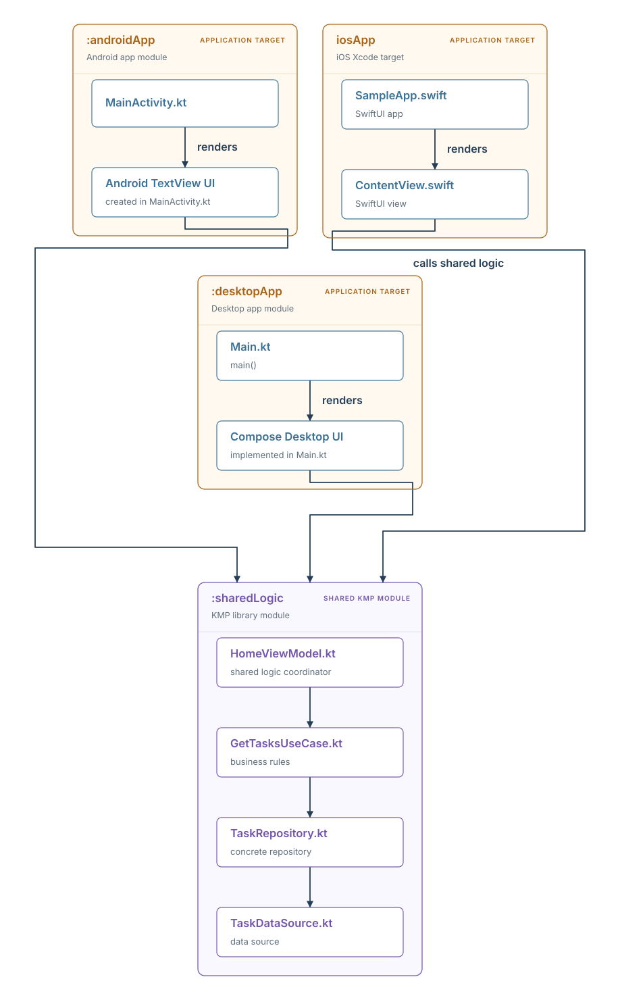
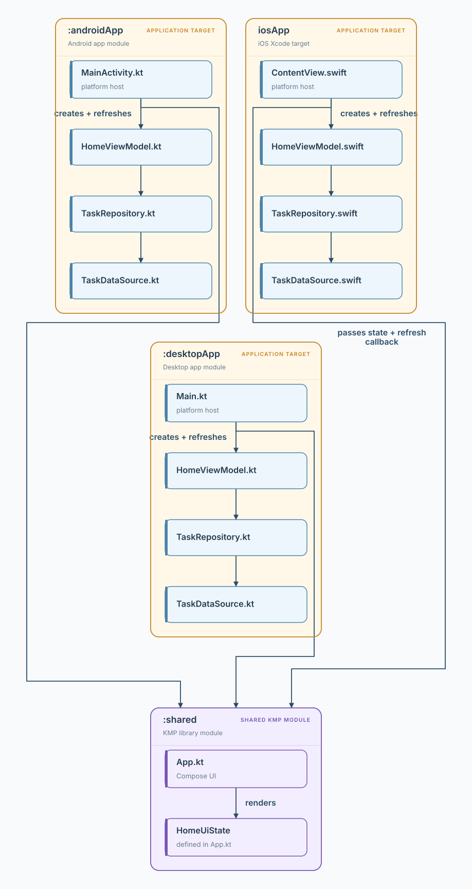
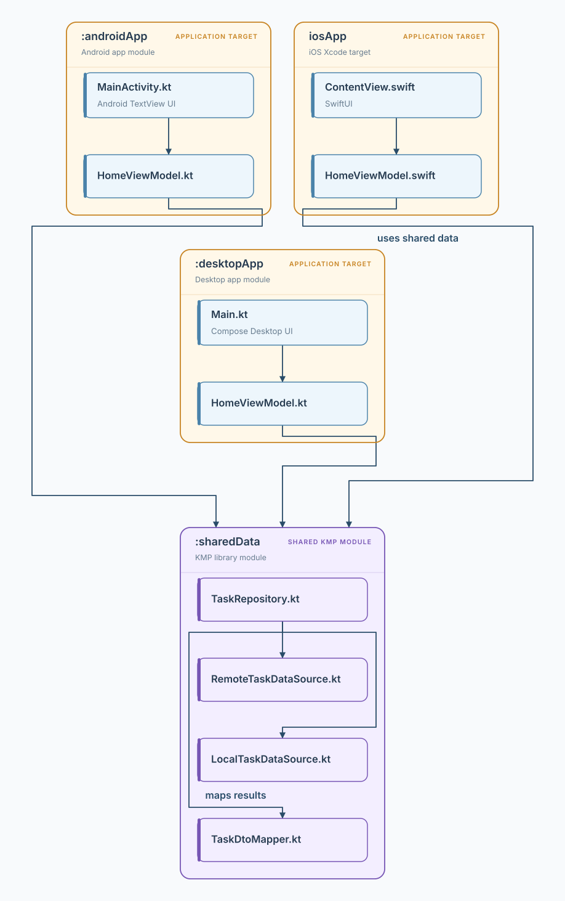
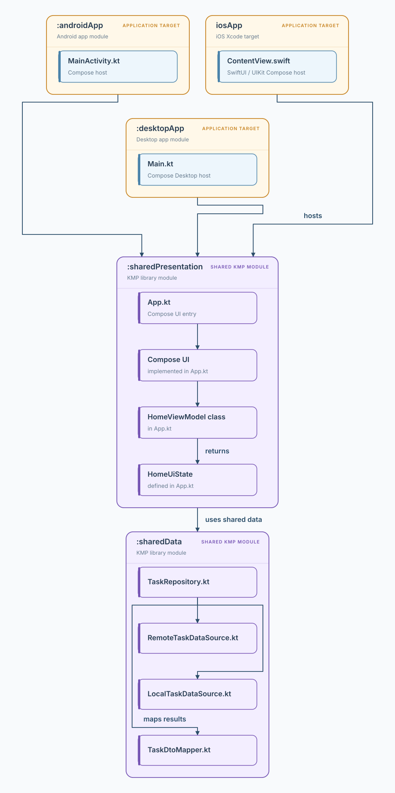
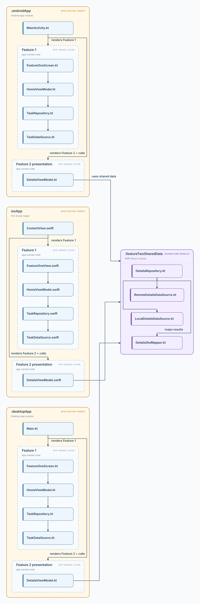
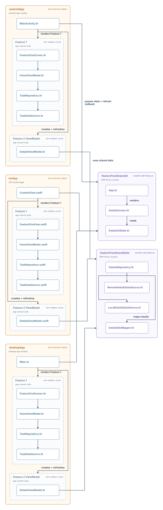

# KMP Sample Diagrams

Kotlin Multiplatform architecture diagrams and runnable sample projects updated for the 2026 KMP default structure and AGP 9.

The previous image set remains available in Git history, so the refreshed version stays reviewable without losing its reference material.

## What Changed

- Each scenario has a high-resolution SVG, a downloadable PNG, and a tightly cropped README preview. The image assets live under [`diagrams/images/`](diagrams/images/) and [`diagrams/previews/`](diagrams/previews/).
- Every diagram uses the same engineering-document frame, embedded typography, semantic module colors, transparent relationship captions, and clear orthogonal dependency arrows.
- [`index.html`](index.html) loads the image-first catalog in [`diagrams/manifest.json`](diagrams/manifest.json) and links to each diagram's SVG, PNG, details, and runnable sample; each details page links to its structured specification.
- Samples use Android, iOS, and desktop only.
- Every sample `iosApp` contains a runnable SwiftUI `iosApp.xcodeproj` with an `iosApp` scheme.
- No `webApp` and no `server` modules are included.
- Shared KMP code lives in KMP library modules. Platform entry points live in `androidApp`, `iosApp`, and `desktopApp`.
- Sample projects now implement the diagram flows with deterministic `Task` / `Details` demo data instead of placeholder messages.

## Versions

| Tool | Version |
| --- | --- |
| Android Gradle Plugin | `9.2.0` |
| Gradle | `9.4.1` |
| Kotlin | `2.3.21` |
| Compose Multiplatform | `1.11.0` |
| JDK | `17` |

## Diagram Viewer

Use the [interactive GitHub Pages viewer](https://thesetox.github.io/kmp-sample-diagrams/) for readable 100% diagrams with pan and zoom. You can also open [`index.html`](index.html) directly in a browser, or serve the repository root with any static HTTP server:

```sh
python3 -m http.server 8000
```

When served over HTTP, the viewer reads [`diagrams/manifest.json`](diagrams/manifest.json). When opened directly from `file://`, it uses the synchronized [`diagrams/catalog.js`](diagrams/catalog.js) fallback. Both modes display the committed SVG assets and provide direct PNG downloads without a diagram-rendering runtime.

Diagram labels use the exact build identity where one exists: names beginning with `:` are Gradle modules, while `iosApp` is an Xcode app target. Solid outer boxes are real modules or targets; dashed inner boxes are app-owned architectural layers or features. A solid arrow reads from caller or owner to the dependency it uses.

## Validate Diagram Assets

The SVG and PNG files are committed deliverables generated from the structured JSON specifications. Install the pinned renderer, rebuild the assets and offline catalog, then validate the complete set:

Connection anchors and optional `{ "x", "y" }` waypoints use the diagram scene coordinate space, before the full-document or preview margins are applied.

```sh
npm ci
npm run render
npm run catalog
npm run validate
npm run pages:build
```

- `npm run render` recreates the full and preview SVGs plus matching `@2x` PNG exports from [`diagrams/specs/`](diagrams/specs/).
- `npm run render:check` fails when a committed image no longer matches its specification, renderer, or embedded Inter font.
- `npm run catalog` synchronizes the local-file fallback with the manifest.
- `npm run catalog:check` fails when the committed catalog is stale.
- `npm run pages:build` stages the viewer, catalog, details, specifications, SVGs, PNGs, previews, and fonts in the ignored `_site/` directory.
- `npm run validate` checks the exact 18-scenario inventory, asset metadata and safety, catalog synchronization, Xcode projects, relative links, and unfinished markers.

## Scenarios

| Scenario | Diagram | Sample |
| --- | --- | --- |
| Normal Native | [SVG](diagrams/images/01-normal-native.svg) · [PNG @2x](diagrams/images/01-normal-native@2x.png) | [`samples/01_normal-native`](samples/01_normal-native/) |
| KMP Native UI | [SVG](diagrams/images/02-kmp-native-ui.svg) · [PNG @2x](diagrams/images/02-kmp-native-ui@2x.png) | [`samples/02_kmp-native-ui`](samples/02_kmp-native-ui/) |
| KMP Compose UI | [SVG](diagrams/images/03-kmp-compose-ui.svg) · [PNG @2x](diagrams/images/03-kmp-compose-ui@2x.png) | [`samples/03_kmp-compose-ui`](samples/03_kmp-compose-ui/) |
| Layered Native | [SVG](diagrams/images/04-layered-native.svg) · [PNG @2x](diagrams/images/04-layered-native@2x.png) | [`samples/04_layered-native`](samples/04_layered-native/) |
| KMP Data Layer | [SVG](diagrams/images/05-kmp-data-layer.svg) · [PNG @2x](diagrams/images/05-kmp-data-layer@2x.png) | [`samples/05_kmp-data-layer`](samples/05_kmp-data-layer/) |
| KMP Presentation Layer | [SVG](diagrams/images/06-kmp-presentation-layer.svg) · [PNG @2x](diagrams/images/06-kmp-presentation-layer@2x.png) | [`samples/06_kmp-presentation-layer`](samples/06_kmp-presentation-layer/) |
| KMP UI Layer | [SVG](diagrams/images/07-kmp-ui-layer.svg) · [PNG @2x](diagrams/images/07-kmp-ui-layer@2x.png) | [`samples/07_kmp-ui-layer`](samples/07_kmp-ui-layer/) |
| KMP Presentation And Data Layers | [SVG](diagrams/images/08-kmp-presentation-data-layer.svg) · [PNG @2x](diagrams/images/08-kmp-presentation-data-layer@2x.png) | [`samples/08_kmp-presentation-data-layer`](samples/08_kmp-presentation-data-layer/) |
| Modular Native | [SVG](diagrams/images/09-modular-native.svg) · [PNG @2x](diagrams/images/09-modular-native@2x.png) | [`samples/09_modular-native`](samples/09_modular-native/) |
| Modular KMP Data Layer | [SVG](diagrams/images/10-modular-kmp-data-layer.svg) · [PNG @2x](diagrams/images/10-modular-kmp-data-layer@2x.png) | [`samples/10_modular-kmp-data-layer`](samples/10_modular-kmp-data-layer/) |
| Modular KMP Presentation Layer | [SVG](diagrams/images/11-modular-kmp-presentation-layer.svg) · [PNG @2x](diagrams/images/11-modular-kmp-presentation-layer@2x.png) | [`samples/11_modular-kmp-presentation-layer`](samples/11_modular-kmp-presentation-layer/) |
| Modular KMP UI Layer | [SVG](diagrams/images/12-modular-kmp-ui-layer.svg) · [PNG @2x](diagrams/images/12-modular-kmp-ui-layer@2x.png) | [`samples/12_modular-kmp-ui-layer`](samples/12_modular-kmp-ui-layer/) |
| Modular KMP UI And Data Layers | [SVG](diagrams/images/13-modular-kmp-ui-data-layer.svg) · [PNG @2x](diagrams/images/13-modular-kmp-ui-data-layer@2x.png) | [`samples/13_modular-kmp-ui-data-layer`](samples/13_modular-kmp-ui-data-layer/) |
| Modular KMP Shared Feature | [SVG](diagrams/images/14-modular-kmp-shared-feature.svg) · [PNG @2x](diagrams/images/14-modular-kmp-shared-feature@2x.png) | [`samples/14_modular-kmp-shared-feature`](samples/14_modular-kmp-shared-feature/) |
| Three Layer Native | [SVG](diagrams/images/15-three-layer-native.svg) · [PNG @2x](diagrams/images/15-three-layer-native@2x.png) | [`samples/15_three-layer-native`](samples/15_three-layer-native/) |
| Three Layer KMP Domain | [SVG](diagrams/images/16-three-layer-kmp-domain.svg) · [PNG @2x](diagrams/images/16-three-layer-kmp-domain@2x.png) | [`samples/16_three-layer-kmp-domain`](samples/16_three-layer-kmp-domain/) |
| Three Layer KMP Domain And Data | [SVG](diagrams/images/18-three-layer-kmp-domain-data.svg) · [PNG @2x](diagrams/images/18-three-layer-kmp-domain-data@2x.png) | [`samples/18_three-layer-kmp-domain-data`](samples/18_three-layer-kmp-domain-data/) |
| Three Layer KMP Domain And Presentation | [SVG](diagrams/images/19-three-layer-kmp-domain-presentation.svg) · [PNG @2x](diagrams/images/19-three-layer-kmp-domain-presentation@2x.png) | [`samples/19_three-layer-kmp-domain-presentation`](samples/19_three-layer-kmp-domain-presentation/) |

Scenario 17 was intentionally removed because it duplicated scenario 16; the original numbering is retained so the remaining scenarios continue to match the legacy reference set.

## Diagram Gallery

All 18 current architecture diagrams are shown below as responsive, tightly cropped SVG previews so GitHub does not shrink the surrounding document frame. Select any image to open its full-resolution SVG; use the [interactive viewer](https://thesetox.github.io/kmp-sample-diagrams/) for pan and zoom on the widest diagrams.

### I. Adding KMP

#### 01. Normal Native

[](diagrams/images/01-normal-native.svg)

[PNG @2x](diagrams/images/01-normal-native@2x.png) · [Diagram details](diagrams/01-normal-native.md) · [Runnable sample](samples/01_normal-native/)

#### 02. KMP Native UI

[](diagrams/images/02-kmp-native-ui.svg)

[PNG @2x](diagrams/images/02-kmp-native-ui@2x.png) · [Diagram details](diagrams/02-kmp-native-ui.md) · [Runnable sample](samples/02_kmp-native-ui/)

#### 03. KMP Compose UI

[](diagrams/images/03-kmp-compose-ui.svg)

[PNG @2x](diagrams/images/03-kmp-compose-ui@2x.png) · [Diagram details](diagrams/03-kmp-compose-ui.md) · [Runnable sample](samples/03_kmp-compose-ui/)

#### 04. Layered Native

[](diagrams/images/04-layered-native.svg)

[PNG @2x](diagrams/images/04-layered-native@2x.png) · [Diagram details](diagrams/04-layered-native.md) · [Runnable sample](samples/04_layered-native/)

#### 05. KMP Data Layer

[](diagrams/images/05-kmp-data-layer.svg)

[PNG @2x](diagrams/images/05-kmp-data-layer@2x.png) · [Diagram details](diagrams/05-kmp-data-layer.md) · [Runnable sample](samples/05_kmp-data-layer/)

#### 06. KMP Presentation Layer

[](diagrams/images/06-kmp-presentation-layer.svg)

[PNG @2x](diagrams/images/06-kmp-presentation-layer@2x.png) · [Diagram details](diagrams/06-kmp-presentation-layer.md) · [Runnable sample](samples/06_kmp-presentation-layer/)

#### 07. KMP UI Layer

[](diagrams/images/07-kmp-ui-layer.svg)

[PNG @2x](diagrams/images/07-kmp-ui-layer@2x.png) · [Diagram details](diagrams/07-kmp-ui-layer.md) · [Runnable sample](samples/07_kmp-ui-layer/)

#### 08. KMP Presentation And Data Layers

[](diagrams/images/08-kmp-presentation-data-layer.svg)

[PNG @2x](diagrams/images/08-kmp-presentation-data-layer@2x.png) · [Diagram details](diagrams/08-kmp-presentation-data-layer.md) · [Runnable sample](samples/08_kmp-presentation-data-layer/)

### II. Adding KMP in Multiple Modules

#### 09. Modular Native

[](diagrams/images/09-modular-native.svg)

[PNG @2x](diagrams/images/09-modular-native@2x.png) · [Diagram details](diagrams/09-modular-native.md) · [Runnable sample](samples/09_modular-native/)

#### 10. Modular KMP Data Layer

[](diagrams/images/10-modular-kmp-data-layer.svg)

[PNG @2x](diagrams/images/10-modular-kmp-data-layer@2x.png) · [Diagram details](diagrams/10-modular-kmp-data-layer.md) · [Runnable sample](samples/10_modular-kmp-data-layer/)

#### 11. Modular KMP Presentation Layer

[](diagrams/images/11-modular-kmp-presentation-layer.svg)

[PNG @2x](diagrams/images/11-modular-kmp-presentation-layer@2x.png) · [Diagram details](diagrams/11-modular-kmp-presentation-layer.md) · [Runnable sample](samples/11_modular-kmp-presentation-layer/)

#### 12. Modular KMP UI Layer

[](diagrams/images/12-modular-kmp-ui-layer.svg)

[PNG @2x](diagrams/images/12-modular-kmp-ui-layer@2x.png) · [Diagram details](diagrams/12-modular-kmp-ui-layer.md) · [Runnable sample](samples/12_modular-kmp-ui-layer/)

#### 13. Modular KMP UI And Data Layers

[](diagrams/images/13-modular-kmp-ui-data-layer.svg)

[PNG @2x](diagrams/images/13-modular-kmp-ui-data-layer@2x.png) · [Diagram details](diagrams/13-modular-kmp-ui-data-layer.md) · [Runnable sample](samples/13_modular-kmp-ui-data-layer/)

#### 14. Modular KMP Shared Feature

[](diagrams/images/14-modular-kmp-shared-feature.svg)

[PNG @2x](diagrams/images/14-modular-kmp-shared-feature@2x.png) · [Diagram details](diagrams/14-modular-kmp-shared-feature.md) · [Runnable sample](samples/14_modular-kmp-shared-feature/)

### III. Adding KMP With Three Layers

#### 15. Three Layer Native

[](diagrams/images/15-three-layer-native.svg)

[PNG @2x](diagrams/images/15-three-layer-native@2x.png) · [Diagram details](diagrams/15-three-layer-native.md) · [Runnable sample](samples/15_three-layer-native/)

#### 16. Three Layer KMP Domain

[](diagrams/images/16-three-layer-kmp-domain.svg)

[PNG @2x](diagrams/images/16-three-layer-kmp-domain@2x.png) · [Diagram details](diagrams/16-three-layer-kmp-domain.md) · [Runnable sample](samples/16_three-layer-kmp-domain/)

#### 18. Three Layer KMP Domain And Data

[](diagrams/images/18-three-layer-kmp-domain-data.svg)

[PNG @2x](diagrams/images/18-three-layer-kmp-domain-data@2x.png) · [Diagram details](diagrams/18-three-layer-kmp-domain-data.md) · [Runnable sample](samples/18_three-layer-kmp-domain-data/)

#### 19. Three Layer KMP Domain And Presentation

[](diagrams/images/19-three-layer-kmp-domain-presentation.svg)

[PNG @2x](diagrams/images/19-three-layer-kmp-domain-presentation@2x.png) · [Diagram details](diagrams/19-three-layer-kmp-domain-presentation.md) · [Runnable sample](samples/19_three-layer-kmp-domain-presentation/)

See [`samples/README.md`](samples/README.md) for each sample's implemented flow and module commands. See [`samples/implementation-review.html`](samples/implementation-review.html) or [`samples/IMPLEMENTATION_REVIEW.md`](samples/IMPLEMENTATION_REVIEW.md) for the per-module review map, and [`TESTING.md`](TESTING.md) for the latest local verification notes.

## AGP 9 KMP Rules Used Here

- Android app entry points are standalone `com.android.application` modules.
- Android app modules rely on AGP built-in Kotlin instead of applying `org.jetbrains.kotlin.android`.
- KMP library modules apply `org.jetbrains.kotlin.multiplatform` and `com.android.kotlin.multiplatform.library`.
- KMP library Android targets are configured inside the Kotlin DSL with `android { ... }`.

## Continuous Verification

[`CI`](.github/workflows/ci.yml) runs repository validation, Android and desktop builds for every scenario, and iOS simulator builds for every Xcode project on pushes to `main` and on pull requests. [`Deploy GitHub Pages`](.github/workflows/pages.yml) validates and publishes the staged HTML viewer whenever `main` changes.

## References

- [JetBrains: A New Default Project Structure for Kotlin Multiplatform](https://blog.jetbrains.com/kotlin/2026/05/new-kmp-default-structure/)
- [Android Gradle Plugin release notes](https://developer.android.com/build/releases/gradle-plugin)
- [Android-KMP library plugin](https://developer.android.com/kotlin/multiplatform/plugin)
- [AGP built-in Kotlin](https://developer.android.com/build/migrate-to-built-in-kotlin)
- [Kotlin releases](https://kotlinlang.org/docs/releases.html)
- [Compose Multiplatform 1.11.0](https://blog.jetbrains.com/kotlin/2026/05/compose-multiplatform-1-11-0/)
