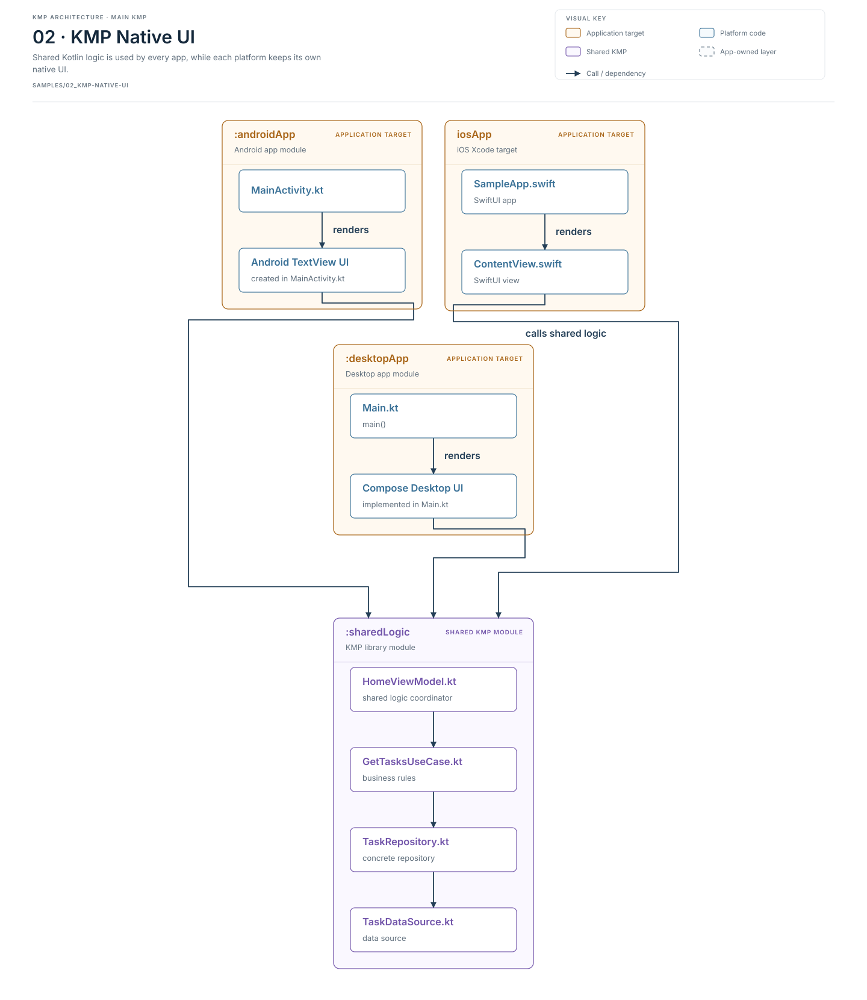
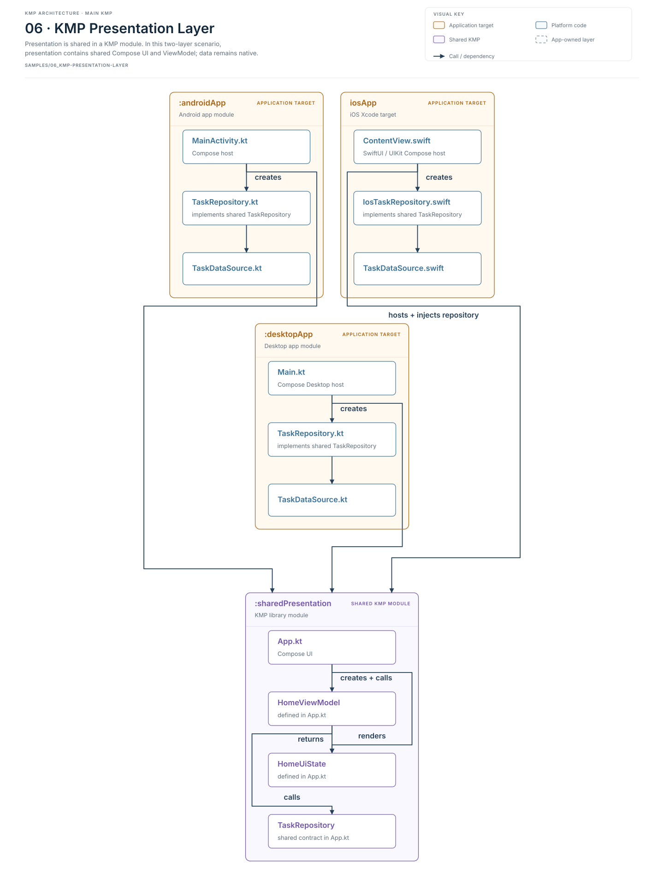
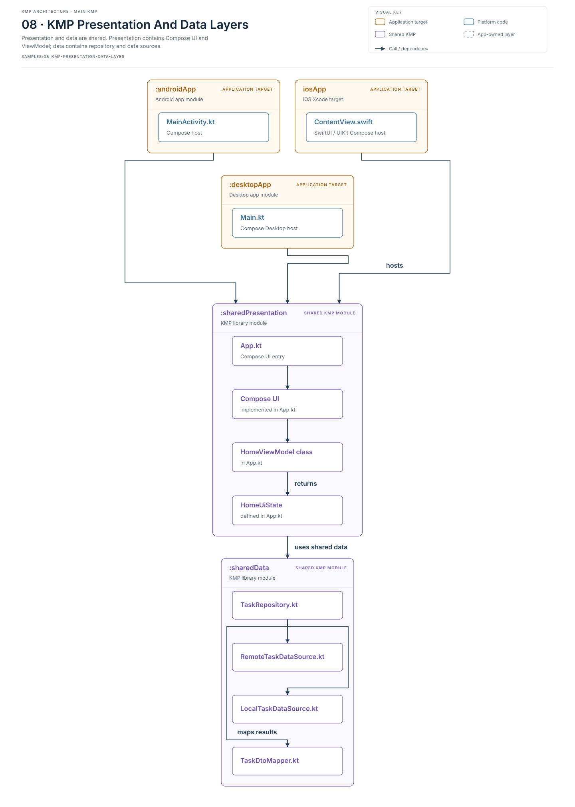
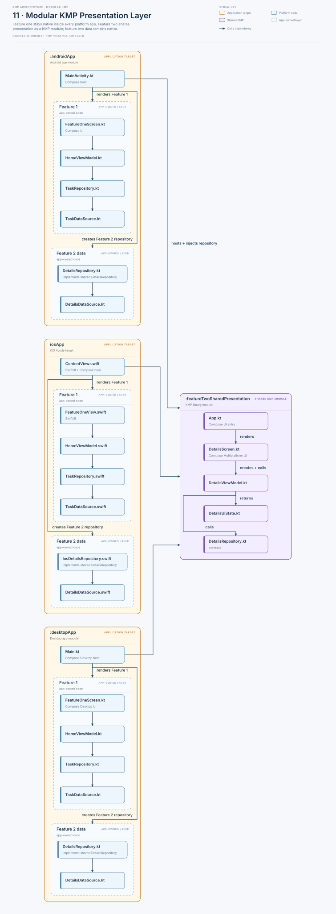
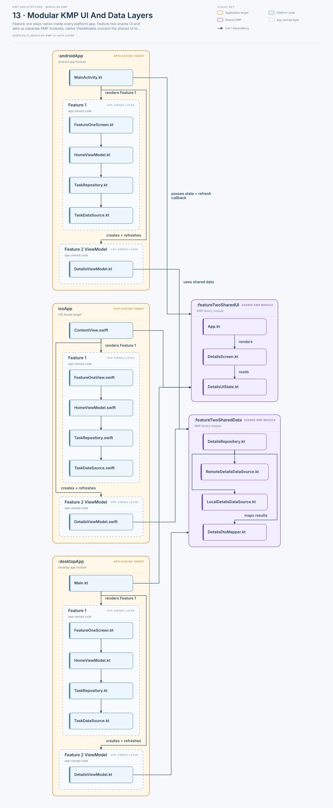
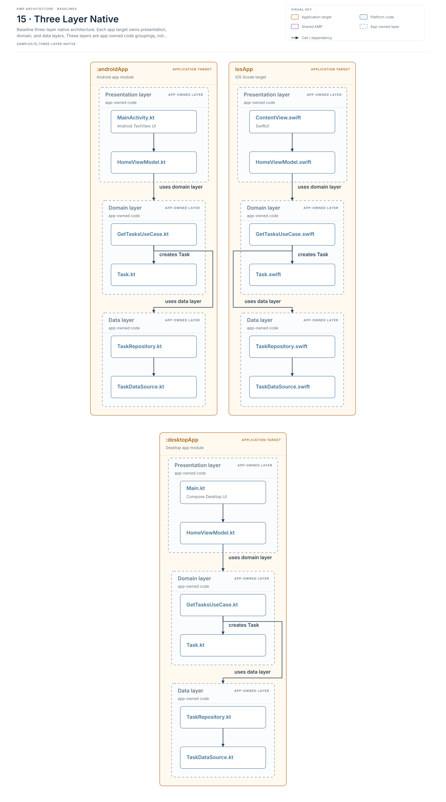

# KMP Sample Diagrams

Kotlin Multiplatform architecture diagrams and runnable sample projects updated for the 2026 KMP default structure and AGP 9.

The old PNG diagrams are preserved on the `feature/legacy-png-reference` branch, so the refreshed version remains reviewable without losing the previous reference material.

## What Changed

- Editable Mermaid source lives in [`diagrams/`](diagrams/) and is rendered into committed SVG images under [`diagrams/images/`](diagrams/images/).
- [`index.html`](index.html) loads every generated image listed in [`diagrams/manifest.json`](diagrams/manifest.json), with links back to its Mermaid source.
- Samples use Android, iOS, and desktop only.
- Every sample `iosApp` contains a runnable SwiftUI `iosApp.xcodeproj` with an `iosApp` scheme.
- No `webApp` and no `server` modules are included.
- Shared KMP code lives in KMP library modules. Platform entry points live in `androidApp`, `iosApp`, and `desktopApp`.
- Sample projects now implement the diagram flows with deterministic `Task` / `Details` demo data instead of placeholder messages.

## Versions

| Tool | Version |
| --- | --- |
| Android Gradle Plugin | `9.2.0` |
| Gradle | `9.4.1` |
| Kotlin | `2.3.21` |
| Compose Multiplatform | `1.11.0` |
| JDK | `17` |

## Diagram Viewer

Open [`index.html`](index.html) directly in a browser, or serve the repository root with any static HTTP server:

```sh
python3 -m http.server 8000
```

When served over HTTP, the viewer loads descriptions from the Markdown files and displays the generated SVGs. When opened directly from `file://`, it falls back to [`diagrams/bundle.js`](diagrams/bundle.js) for the descriptions; the committed SVG images continue to load locally. The viewer no longer needs a Mermaid CDN at runtime.

Diagram labels use the exact build identity where one exists: names beginning with `:` are Gradle modules, while `iosApp` is an Xcode app target. Solid outer boxes are real modules or targets; dashed inner boxes are app-owned architectural layers or features. A solid arrow reads from caller or owner to the dependency it uses.

## Rebuild And Validate Diagrams

The image workflow pins Mermaid CLI so every SVG can be regenerated from the fenced Mermaid block in its matching Markdown file:

```sh
npm ci
npm run render
npm run bundle
npm run validate
```

- `npm run render` recreates all files under [`diagrams/images/`](diagrams/images/).
- `npm run bundle` synchronizes the local-file fallback with the manifest and Markdown sources.
- `npm run validate` checks the scenario inventory, Mermaid fences, SVGs, bundle, Xcode projects, relative links, and unfinished markers.
- `npm run render:check` renders every Mermaid source as a smoke test and verifies the render-input fingerprint stored in each SVG; `npm run bundle:check` verifies the offline bundle. Both fail when generated artifacts are stale.

## Scenarios

| Scenario | Diagram | Sample |
| --- | --- | --- |
| Normal Native | [`01-normal-native.md`](diagrams/01-normal-native.md) | [`samples/01_normal-native`](samples/01_normal-native/) |
| KMP Native UI | [`02-kmp-native-ui.md`](diagrams/02-kmp-native-ui.md) | [`samples/02_kmp-native-ui`](samples/02_kmp-native-ui/) |
| KMP Compose UI | [`03-kmp-compose-ui.md`](diagrams/03-kmp-compose-ui.md) | [`samples/03_kmp-compose-ui`](samples/03_kmp-compose-ui/) |
| Layered Native | [`04-layered-native.md`](diagrams/04-layered-native.md) | [`samples/04_layered-native`](samples/04_layered-native/) |
| KMP Data Layer | [`05-kmp-data-layer.md`](diagrams/05-kmp-data-layer.md) | [`samples/05_kmp-data-layer`](samples/05_kmp-data-layer/) |
| KMP Presentation Layer | [`06-kmp-presentation-layer.md`](diagrams/06-kmp-presentation-layer.md) | [`samples/06_kmp-presentation-layer`](samples/06_kmp-presentation-layer/) |
| KMP UI Layer | [`07-kmp-ui-layer.md`](diagrams/07-kmp-ui-layer.md) | [`samples/07_kmp-ui-layer`](samples/07_kmp-ui-layer/) |
| KMP Presentation And Data Layers | [`08-kmp-presentation-data-layer.md`](diagrams/08-kmp-presentation-data-layer.md) | [`samples/08_kmp-presentation-data-layer`](samples/08_kmp-presentation-data-layer/) |
| Modular Native | [`09-modular-native.md`](diagrams/09-modular-native.md) | [`samples/09_modular-native`](samples/09_modular-native/) |
| Modular KMP Data Layer | [`10-modular-kmp-data-layer.md`](diagrams/10-modular-kmp-data-layer.md) | [`samples/10_modular-kmp-data-layer`](samples/10_modular-kmp-data-layer/) |
| Modular KMP Presentation Layer | [`11-modular-kmp-presentation-layer.md`](diagrams/11-modular-kmp-presentation-layer.md) | [`samples/11_modular-kmp-presentation-layer`](samples/11_modular-kmp-presentation-layer/) |
| Modular KMP UI Layer | [`12-modular-kmp-ui-layer.md`](diagrams/12-modular-kmp-ui-layer.md) | [`samples/12_modular-kmp-ui-layer`](samples/12_modular-kmp-ui-layer/) |
| Modular KMP UI And Data Layers | [`13-modular-kmp-ui-data-layer.md`](diagrams/13-modular-kmp-ui-data-layer.md) | [`samples/13_modular-kmp-ui-data-layer`](samples/13_modular-kmp-ui-data-layer/) |
| Modular KMP Shared Feature | [`14-modular-kmp-shared-feature.md`](diagrams/14-modular-kmp-shared-feature.md) | [`samples/14_modular-kmp-shared-feature`](samples/14_modular-kmp-shared-feature/) |
| Three Layer Native | [`15-three-layer-native.md`](diagrams/15-three-layer-native.md) | [`samples/15_three-layer-native`](samples/15_three-layer-native/) |
| Three Layer KMP Domain | [`16-three-layer-kmp-domain.md`](diagrams/16-three-layer-kmp-domain.md) | [`samples/16_three-layer-kmp-domain`](samples/16_three-layer-kmp-domain/) |
| Three Layer KMP Domain And Data | [`18-three-layer-kmp-domain-data.md`](diagrams/18-three-layer-kmp-domain-data.md) | [`samples/18_three-layer-kmp-domain-data`](samples/18_three-layer-kmp-domain-data/) |
| Three Layer KMP Domain And Presentation | [`19-three-layer-kmp-domain-presentation.md`](diagrams/19-three-layer-kmp-domain-presentation.md) | [`samples/19_three-layer-kmp-domain-presentation`](samples/19_three-layer-kmp-domain-presentation/) |

Scenario 17 was intentionally removed because it duplicated scenario 16; the original numbering is retained so the remaining scenarios continue to match the legacy reference set.

## Diagram Gallery

All 18 current architecture diagrams are shown below. Select any image to open it at full resolution.

### I. Adding KMP

#### 01. Normal Native

[](diagrams/images/01-normal-native.svg)

[Mermaid source](diagrams/01-normal-native.md) · [Runnable sample](samples/01_normal-native/)

#### 02. KMP Native UI

[](diagrams/images/02-kmp-native-ui.svg)

[Mermaid source](diagrams/02-kmp-native-ui.md) · [Runnable sample](samples/02_kmp-native-ui/)

#### 03. KMP Compose UI

[](diagrams/images/03-kmp-compose-ui.svg)

[Mermaid source](diagrams/03-kmp-compose-ui.md) · [Runnable sample](samples/03_kmp-compose-ui/)

#### 04. Layered Native

[](diagrams/images/04-layered-native.svg)

[Mermaid source](diagrams/04-layered-native.md) · [Runnable sample](samples/04_layered-native/)

#### 05. KMP Data Layer

[](diagrams/images/05-kmp-data-layer.svg)

[Mermaid source](diagrams/05-kmp-data-layer.md) · [Runnable sample](samples/05_kmp-data-layer/)

#### 06. KMP Presentation Layer

[](diagrams/images/06-kmp-presentation-layer.svg)

[Mermaid source](diagrams/06-kmp-presentation-layer.md) · [Runnable sample](samples/06_kmp-presentation-layer/)

#### 07. KMP UI Layer

[](diagrams/images/07-kmp-ui-layer.svg)

[Mermaid source](diagrams/07-kmp-ui-layer.md) · [Runnable sample](samples/07_kmp-ui-layer/)

#### 08. KMP Presentation And Data Layers

[](diagrams/images/08-kmp-presentation-data-layer.svg)

[Mermaid source](diagrams/08-kmp-presentation-data-layer.md) · [Runnable sample](samples/08_kmp-presentation-data-layer/)

### II. Adding KMP in Multiple Modules

#### 09. Modular Native

[](diagrams/images/09-modular-native.svg)

[Mermaid source](diagrams/09-modular-native.md) · [Runnable sample](samples/09_modular-native/)

#### 10. Modular KMP Data Layer

[](diagrams/images/10-modular-kmp-data-layer.svg)

[Mermaid source](diagrams/10-modular-kmp-data-layer.md) · [Runnable sample](samples/10_modular-kmp-data-layer/)

#### 11. Modular KMP Presentation Layer

[](diagrams/images/11-modular-kmp-presentation-layer.svg)

[Mermaid source](diagrams/11-modular-kmp-presentation-layer.md) · [Runnable sample](samples/11_modular-kmp-presentation-layer/)

#### 12. Modular KMP UI Layer

[](diagrams/images/12-modular-kmp-ui-layer.svg)

[Mermaid source](diagrams/12-modular-kmp-ui-layer.md) · [Runnable sample](samples/12_modular-kmp-ui-layer/)

#### 13. Modular KMP UI And Data Layers

[](diagrams/images/13-modular-kmp-ui-data-layer.svg)

[Mermaid source](diagrams/13-modular-kmp-ui-data-layer.md) · [Runnable sample](samples/13_modular-kmp-ui-data-layer/)

#### 14. Modular KMP Shared Feature

[](diagrams/images/14-modular-kmp-shared-feature.svg)

[Mermaid source](diagrams/14-modular-kmp-shared-feature.md) · [Runnable sample](samples/14_modular-kmp-shared-feature/)

### III. Adding KMP With Three Layers

#### 15. Three Layer Native

[](diagrams/images/15-three-layer-native.svg)

[Mermaid source](diagrams/15-three-layer-native.md) · [Runnable sample](samples/15_three-layer-native/)

#### 16. Three Layer KMP Domain

[](diagrams/images/16-three-layer-kmp-domain.svg)

[Mermaid source](diagrams/16-three-layer-kmp-domain.md) · [Runnable sample](samples/16_three-layer-kmp-domain/)

#### 18. Three Layer KMP Domain And Data

[](diagrams/images/18-three-layer-kmp-domain-data.svg)

[Mermaid source](diagrams/18-three-layer-kmp-domain-data.md) · [Runnable sample](samples/18_three-layer-kmp-domain-data/)

#### 19. Three Layer KMP Domain And Presentation

[](diagrams/images/19-three-layer-kmp-domain-presentation.svg)

[Mermaid source](diagrams/19-three-layer-kmp-domain-presentation.md) · [Runnable sample](samples/19_three-layer-kmp-domain-presentation/)

See [`samples/README.md`](samples/README.md) for each sample's implemented flow and module commands. See [`samples/implementation-review.html`](samples/implementation-review.html) or [`samples/IMPLEMENTATION_REVIEW.md`](samples/IMPLEMENTATION_REVIEW.md) for the per-module review map, and [`TESTING.md`](TESTING.md) for the latest local verification notes.

## AGP 9 KMP Rules Used Here

- Android app entry points are standalone `com.android.application` modules.
- Android app modules rely on AGP built-in Kotlin instead of applying `org.jetbrains.kotlin.android`.
- KMP library modules apply `org.jetbrains.kotlin.multiplatform` and `com.android.kotlin.multiplatform.library`.
- KMP library Android targets are configured inside the Kotlin DSL with `android { ... }`.

## Continuous Verification

[`CI`](.github/workflows/ci.yml) runs repository validation, Android and desktop builds for every scenario, and iOS simulator builds for every Xcode project on pushes to `main` and on pull requests.

## References

- [JetBrains: A New Default Project Structure for Kotlin Multiplatform](https://blog.jetbrains.com/kotlin/2026/05/new-kmp-default-structure/)
- [Android Gradle Plugin release notes](https://developer.android.com/build/releases/gradle-plugin)
- [Android-KMP library plugin](https://developer.android.com/kotlin/multiplatform/plugin)
- [AGP built-in Kotlin](https://developer.android.com/build/migrate-to-built-in-kotlin)
- [Kotlin releases](https://kotlinlang.org/docs/releases.html)
- [Compose Multiplatform 1.11.0](https://blog.jetbrains.com/kotlin/2026/05/compose-multiplatform-1-11-0/)
