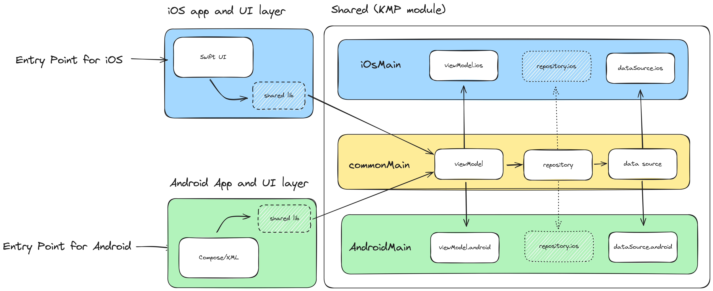

# kmp-sample-diagrams

Sample diagrams when using Kotlin Multiplatform.

# I. Adding KMP

## 1. Normal Approach

## 2-1. KMP - Native UI

## 2-2. KMP - Compose Multiplatform

## 3. Main with UI and Data Layer

## 4. KMP - Data Layer

## 5. KMP - Presentation Layer

## 6. KMP - UI Layer

## 7. KMP - UI and Data Layer

# II. Adding KMP in Multiple Modules

## 1. Main Modular Approach

## 2. KMP - Data Layer (Modular)

## 3. KMP - Presentation Layer (Modular)

## 4. KMP - UI Layer (Modular)

## 5. KMP - UI and Data Layer (Modular)

## 6. KMP - Shared Module (Modular)

# III. Adding KMP that has Three Layers 

## 1. Three Layer Approach

## 2-1. KMP - Domain Layer

## 2-2. KMP - Domain Layer (Simple Version)

## 3. KMP - Domain and Data Layer

## 4. KMP - Domain and Presentation Layer

