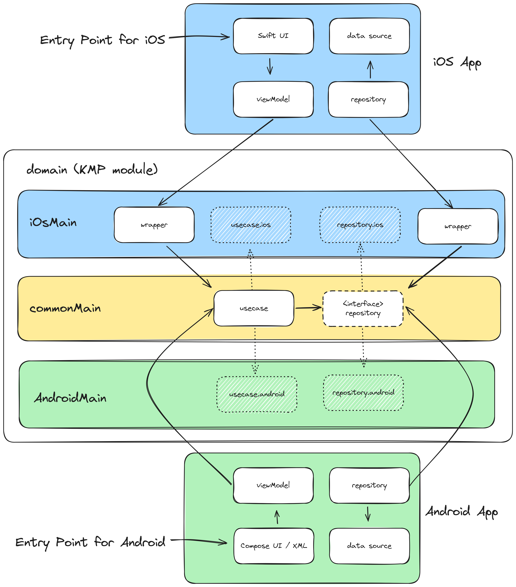

# kmp-sample-diagrams

Sample diagrams when using Kotlin Multiplatform to be able to visualize how Kotlin Multiplatform
can be added to exisitng project.

# I. Adding KMP

## 1. Normal Approach

This approach showcase when iOS and android development is being created separately.

## 2-1. KMP - Native UI

This approach showcase when you use Kotlin Multiplatform without updating the implementation
of the UI screens depending on their platform.

## 2-2. KMP - Compose Multiplatform

This approach showcase using both Kotlin Multiplatform and Compose Multiplatform to be able to
reuse UI components in both Android and iOS.

## 3. Main with UI and Data Layer

This showcase how you can layer your project into two (UI and Data Layer). This will help
on refactoring specific layer if needed.

## 4. KMP - Data Layer

Here is an example using Kotlin Multiplatform in the Data Layer.

## 5. KMP - Presentation Layer

Here is an example using Kotlin Multiplatform in the Presentation Layer (ViewModel and UI screens).

## 6. KMP - UI Layer

Here is an example using Kotlin Multiplatform in the UI only (Compose Multiplatform).

## 7. KMP - Presentation and Data Layer

Here is an example when using Kotlin Multiplatform in both layers. (Presentation and Data Layer)

# II. Adding KMP in Multiple Modules

## 1. Main Modular Approach

## 2. KMP - Data Layer (Modular)

## 3. KMP - Presentation Layer (Modular)

## 4. KMP - UI Layer (Modular)

## 5. KMP - UI and Data Layer (Modular)

## 6. KMP - Shared Module (Modular)

# III. Adding KMP that has Three Layers 

## 1. Three Layer Approach

## 2-1. KMP - Domain Layer

## 2-2. KMP - Domain Layer (Simple Version)

## 3. KMP - Domain and Data Layer

## 4. KMP - Domain and Presentation Layer

