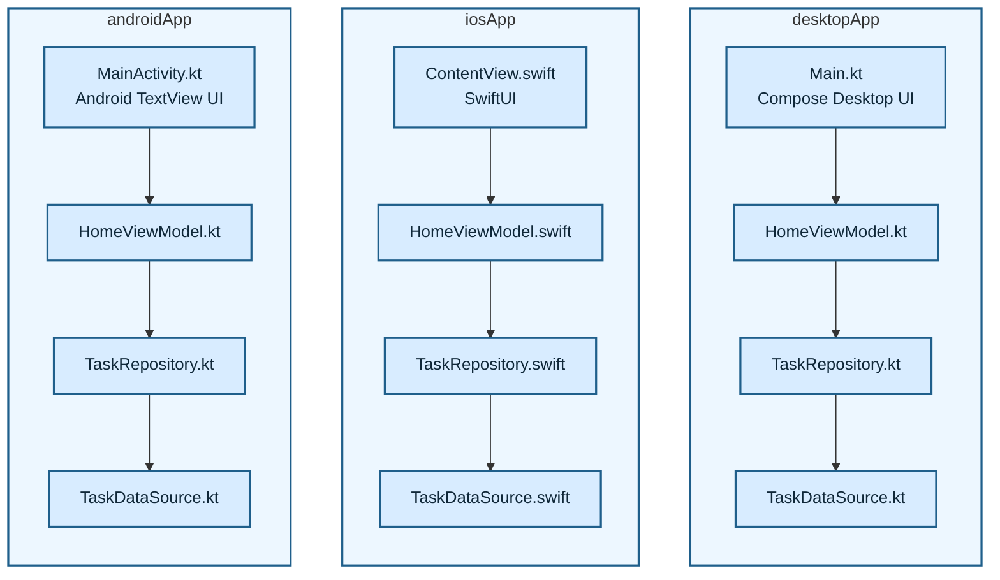

# 01. Normal Native

Baseline with separate platform app targets. There is no shared KMP module.

```mermaid
flowchart TB
  subgraph Desktop["desktopApp"]
    direction TB
    DUI["Main.kt\nCompose Desktop UI"]
    DVM["HomeViewModel.kt"]
    DRepository["TaskRepository.kt"]
    DDataSource["TaskDataSource.kt"]
    DUI --> DVM --> DRepository --> DDataSource
  end

  subgraph IOS["iosApp"]
    direction TB
    IUI["ContentView.swift\nSwiftUI"]
    IVM["HomeViewModel.swift"]
    IRepository["TaskRepository.swift"]
    IDataSource["TaskDataSource.swift"]
    IUI --> IVM --> IRepository --> IDataSource
  end

  subgraph Android["androidApp"]
    direction TB
    AUI["MainActivity.kt\nAndroid TextView UI"]
    AVM["HomeViewModel.kt"]
    ARepository["TaskRepository.kt"]
    ADataSource["TaskDataSource.kt"]
    AUI --> AVM --> ARepository --> ADataSource
  end

  classDef app fill:#d8ecff,stroke:#1f5f8b,color:#0f2738,stroke-width:2px;
  class AUI,AVM,ARepository,ADataSource,IUI,IVM,IRepository,IDataSource,DUI,DVM,DRepository,DDataSource app;
  style Android fill:#edf7ff,stroke:#1f5f8b,stroke-width:2px
  style IOS fill:#edf7ff,stroke:#1f5f8b,stroke-width:2px
  style Desktop fill:#edf7ff,stroke:#1f5f8b,stroke-width:2px
```
