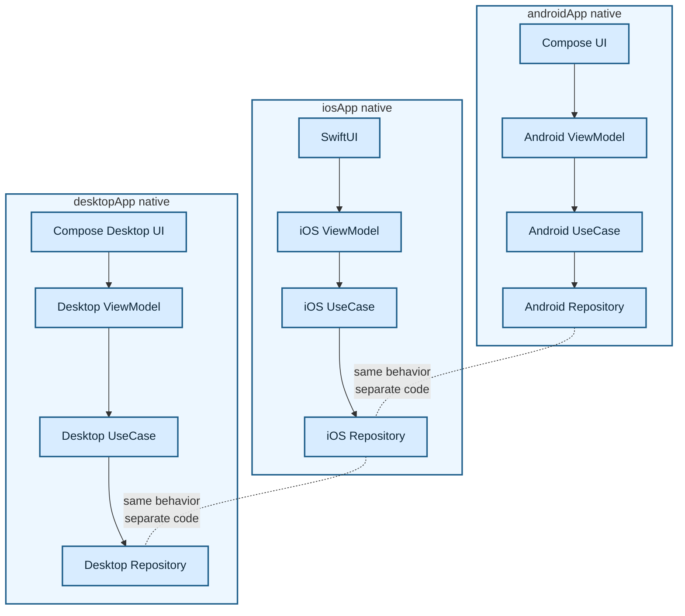

# 01. Normal Native

Baseline with separate platform apps. There is no shared KMP module.

```mermaid
flowchart TB
  subgraph Android["androidApp native"]
    AUI["Compose UI"]
    AVM["Android ViewModel"]
    AUseCase["Android UseCase"]
    ARepository["Android Repository"]
    AUI --> AVM --> AUseCase --> ARepository
  end

  subgraph IOS["iosApp native"]
    IUI["SwiftUI"]
    IVM["iOS ViewModel"]
    IUseCase["iOS UseCase"]
    IRepository["iOS Repository"]
    IUI --> IVM --> IUseCase --> IRepository
  end

  subgraph Desktop["desktopApp native"]
    DUI["Compose Desktop UI"]
    DVM["Desktop ViewModel"]
    DUseCase["Desktop UseCase"]
    DRepository["Desktop Repository"]
    DUI --> DVM --> DUseCase --> DRepository
  end

  ARepository -. "same behavior\nseparate code" .- IRepository
  IRepository -. "same behavior\nseparate code" .- DRepository

  classDef app fill:#d8ecff,stroke:#1f5f8b,color:#0f2738,stroke-width:2px;
  class AUI,AVM,AUseCase,ARepository,IUI,IVM,IUseCase,IRepository,DUI,DVM,DUseCase,DRepository app;
  style Android fill:#edf7ff,stroke:#1f5f8b,stroke-width:2px
  style IOS fill:#edf7ff,stroke:#1f5f8b,stroke-width:2px
  style Desktop fill:#edf7ff,stroke:#1f5f8b,stroke-width:2px
```
