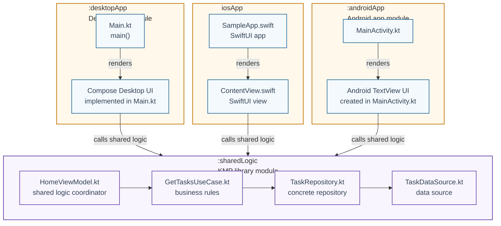

# 02. KMP Native UI

Shared Kotlin logic is used by every app, while each platform keeps its own native UI.

```mermaid
flowchart TB
  subgraph Android[":androidApp\nAndroid app module"]
    direction TB
    AEntry["MainActivity.kt"]
    AUI["Android TextView UI\ncreated in MainActivity.kt"]
    AEntry -->|"renders"| AUI
  end

  subgraph IOS["iosApp\niOS Xcode target"]
    direction TB
    IEntry["SampleApp.swift\nSwiftUI app"]
    IUI["ContentView.swift\nSwiftUI view"]
    IEntry -->|"renders"| IUI
  end

  subgraph Desktop[":desktopApp\nDesktop app module"]
    direction TB
    DEntry["Main.kt\nmain()"]
    DUI["Compose Desktop UI\nimplemented in Main.kt"]
    DEntry -->|"renders"| DUI
  end

  subgraph KMP[":sharedLogic\nKMP library module"]
    direction LR
    VM["HomeViewModel.kt\nshared logic coordinator"]
    UseCase["GetTasksUseCase.kt\nbusiness rules"]
    Repository["TaskRepository.kt\nconcrete repository"]
    DataSource["TaskDataSource.kt\ndata source"]
    VM --> UseCase --> Repository --> DataSource
  end

  DUI -->|"calls shared logic"| KMP
  IUI -->|"calls shared logic"| KMP
  AUI -->|"calls shared logic"| KMP

  classDef app fill:#f3f9fc,stroke:#2b6f9e,color:#334155,stroke-width:1.4px;
  classDef kmp fill:#f8f5fe,stroke:#6e4bae,color:#334155,stroke-width:1.4px;
  class AEntry,AUI,IEntry,IUI,DEntry,DUI app;
  class VM,UseCase,Repository,DataSource kmp;
  style Android fill:#fff8eb,stroke:#c47a12,stroke-width:1.6px
  style IOS fill:#fff8eb,stroke:#c47a12,stroke-width:1.6px
  style Desktop fill:#fff8eb,stroke:#c47a12,stroke-width:1.6px
  style KMP fill:#f8f5fe,stroke:#6e4bae,stroke-width:1.6px
```
