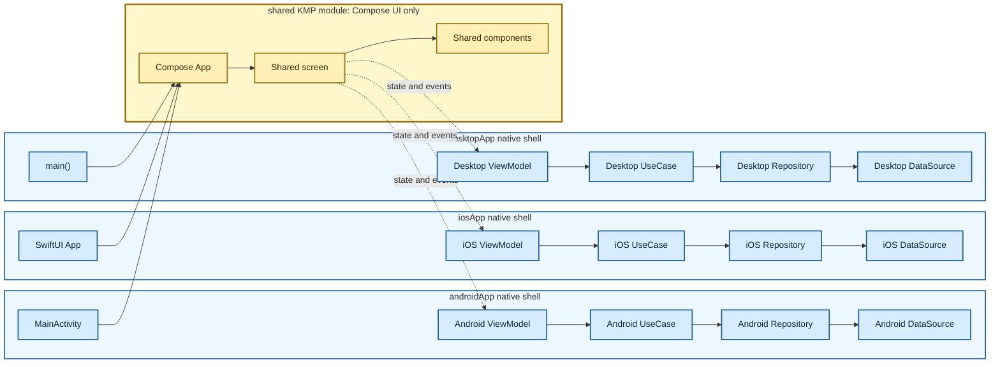

# 03. KMP Compose UI

All platform entry points are separate app modules. Compose UI is shared, while ViewModel, use case, repository, and data source logic stay native.

```mermaid
flowchart LR
  subgraph Android["androidApp native shell"]
    AEntry["MainActivity"]
    AVM["Android ViewModel"]
    AUseCase["Android UseCase"]
    ARepository["Android Repository"]
    ADataSource["Android DataSource"]
    AVM --> AUseCase --> ARepository --> ADataSource
  end

  subgraph IOS["iosApp native shell"]
    IEntry["SwiftUI App"]
    IVM["iOS ViewModel"]
    IUseCase["iOS UseCase"]
    IRepository["iOS Repository"]
    IDataSource["iOS DataSource"]
    IVM --> IUseCase --> IRepository --> IDataSource
  end

  subgraph Desktop["desktopApp native shell"]
    DEntry["main()"]
    DVM["Desktop ViewModel"]
    DUseCase["Desktop UseCase"]
    DRepository["Desktop Repository"]
    DDataSource["Desktop DataSource"]
    DVM --> DUseCase --> DRepository --> DDataSource
  end

  subgraph KMP["shared KMP module: Compose UI only"]
    direction LR
    App["Compose App"]
    Screen["Shared screen"]
    Components["Shared components"]
    App --> Screen --> Components
  end

  AEntry --> App
  IEntry --> App
  DEntry --> App
  Screen -. "state and events" .-> AVM
  Screen -. "state and events" .-> IVM
  Screen -. "state and events" .-> DVM

  classDef app fill:#d8ecff,stroke:#1f5f8b,color:#0f2738,stroke-width:2px;
  classDef kmp fill:#fff0b8,stroke:#9b7415,color:#3b2a00,stroke-width:2px;
  class AEntry,AVM,AUseCase,ARepository,ADataSource,IEntry,IVM,IUseCase,IRepository,IDataSource,DEntry,DVM,DUseCase,DRepository,DDataSource app;
  class App,Screen,Components kmp;
  style Android fill:#edf7ff,stroke:#1f5f8b,stroke-width:2px
  style IOS fill:#edf7ff,stroke:#1f5f8b,stroke-width:2px
  style Desktop fill:#edf7ff,stroke:#1f5f8b,stroke-width:2px
  style KMP fill:#fff7cc,stroke:#9b7415,stroke-width:3px
```
