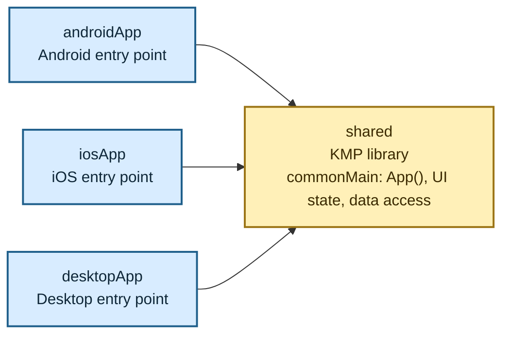

# 03. KMP Compose UI

All platform entry points are separate app modules. Shared Compose UI and shared logic live in the `shared` KMP library.

```mermaid
flowchart LR
  Shared["shared\nKMP library\ncommonMain: App(), UI state, data access"]

  Android["androidApp\nAndroid entry point"]
  IOS["iosApp\niOS entry point"]
  Desktop["desktopApp\nDesktop entry point"]

  Android --> Shared
  IOS --> Shared
  Desktop --> Shared

  classDef app fill:#d8ecff,stroke:#1f5f8b,color:#0f2738,stroke-width:2px;
  classDef shared fill:#fff0b8,stroke:#9b7415,color:#3b2a00,stroke-width:2px;
  class Android,IOS,Desktop app;
  class Shared shared;
```

