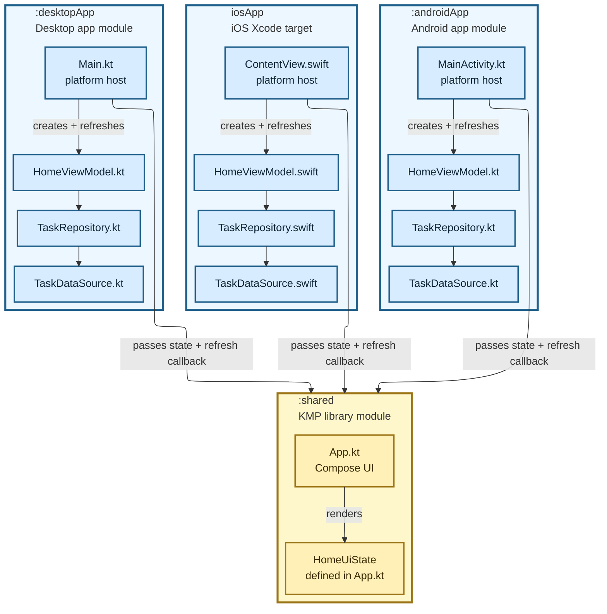

# 03. KMP Compose UI

All platform entry points are separate app targets. Compose UI is shared, while ViewModel, repository, and data source logic stay native.

```mermaid
---
config:
  layout: elk
  elk:
    nodePlacementStrategy: LINEAR_SEGMENTS
---
flowchart TB
  subgraph Android[":androidApp\nAndroid app module"]
    AEntry["MainActivity.kt\nplatform host"]
    AVM["HomeViewModel.kt"]
    ARepository["TaskRepository.kt"]
    ADataSource["TaskDataSource.kt"]
    AEntry -->|"creates + refreshes"| AVM
    AVM --> ARepository --> ADataSource
  end

  subgraph IOS["iosApp\niOS Xcode target"]
    IEntry["ContentView.swift\nplatform host"]
    IVM["HomeViewModel.swift"]
    IRepository["TaskRepository.swift"]
    IDataSource["TaskDataSource.swift"]
    IEntry -->|"creates + refreshes"| IVM
    IVM --> IRepository --> IDataSource
  end

  subgraph Desktop[":desktopApp\nDesktop app module"]
    DEntry["Main.kt\nplatform host"]
    DVM["HomeViewModel.kt"]
    DRepository["TaskRepository.kt"]
    DDataSource["TaskDataSource.kt"]
    DEntry -->|"creates + refreshes"| DVM
    DVM --> DRepository --> DDataSource
  end

  subgraph KMP[":shared\nKMP library module"]
    direction TB
    App["App.kt\nCompose UI"]
    State["HomeUiState\ndefined in App.kt"]
    App -->|"renders"| State
  end

  DEntry -->|"passes state + refresh callback"| KMP
  IEntry -->|"passes state + refresh callback"| KMP
  AEntry -->|"passes state + refresh callback"| KMP

  classDef app fill:#d8ecff,stroke:#1f5f8b,color:#0f2738,stroke-width:2px;
  classDef kmp fill:#fff0b8,stroke:#9b7415,color:#3b2a00,stroke-width:2px;
  class AEntry,AVM,ARepository,ADataSource,IEntry,IVM,IRepository,IDataSource,DEntry,DVM,DRepository,DDataSource app;
  class App,State kmp;
  style Android fill:#edf7ff,stroke:#1f5f8b,stroke-width:3px
  style IOS fill:#edf7ff,stroke:#1f5f8b,stroke-width:3px
  style Desktop fill:#edf7ff,stroke:#1f5f8b,stroke-width:3px
  style KMP fill:#fff7cc,stroke:#9b7415,stroke-width:3px
```
