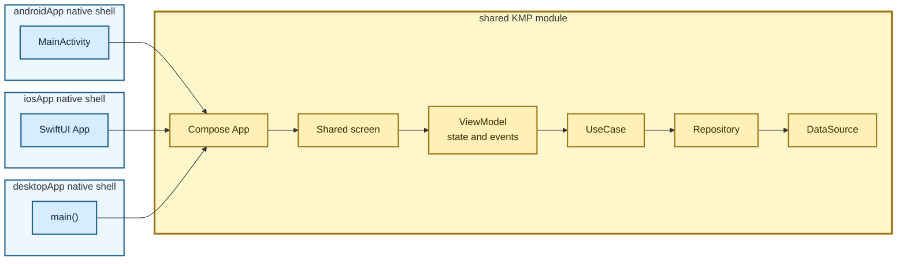

# 03. KMP Compose UI

All platform entry points are separate app modules. Shared Compose UI and shared logic live inside the `shared` KMP module.

```mermaid
flowchart LR
  subgraph Android["androidApp native shell"]
    AEntry["MainActivity"]
  end

  subgraph IOS["iosApp native shell"]
    IEntry["SwiftUI App"]
  end

  subgraph Desktop["desktopApp native shell"]
    DEntry["main()"]
  end

  subgraph KMP["shared KMP module"]
    direction LR
    App["Compose App"]
    Screen["Shared screen"]
    VM["ViewModel\nstate and events"]
    UseCase["UseCase"]
    Repository["Repository"]
    DataSource["DataSource"]
    App --> Screen --> VM --> UseCase --> Repository --> DataSource
  end

  AEntry --> App
  IEntry --> App
  DEntry --> App

  classDef app fill:#d8ecff,stroke:#1f5f8b,color:#0f2738,stroke-width:2px;
  classDef kmp fill:#fff0b8,stroke:#9b7415,color:#3b2a00,stroke-width:2px;
  class AEntry,IEntry,DEntry app;
  class App,Screen,VM,UseCase,Repository,DataSource kmp;
  style Android fill:#edf7ff,stroke:#1f5f8b,stroke-width:2px
  style IOS fill:#edf7ff,stroke:#1f5f8b,stroke-width:2px
  style Desktop fill:#edf7ff,stroke:#1f5f8b,stroke-width:2px
  style KMP fill:#fff7cc,stroke:#9b7415,stroke-width:3px
```
