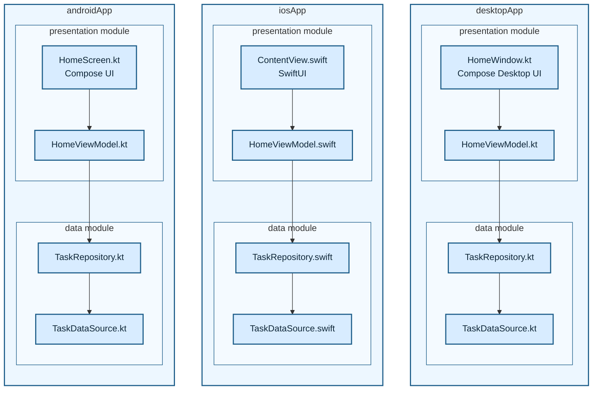

# 04. Layered Native

Baseline layered architecture. Each app target owns a presentation module and a data module. Presentation contains UI and ViewModel; there is no domain/use-case layer in this scenario.

