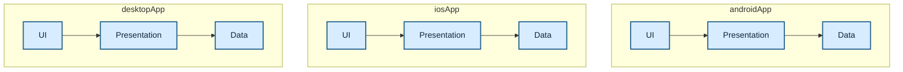

# 04. Layered Native

Baseline layered architecture with platform-specific UI and data layers.

```mermaid
flowchart TB
  subgraph Android["androidApp"]
    AUI["UI"]
    APresentation["Presentation"]
    AData["Data"]
    AUI --> APresentation --> AData
  end

  subgraph IOS["iosApp"]
    IUI["UI"]
    IPresentation["Presentation"]
    IData["Data"]
    IUI --> IPresentation --> IData
  end

  subgraph Desktop["desktopApp"]
    DUI["UI"]
    DPresentation["Presentation"]
    DData["Data"]
    DUI --> DPresentation --> DData
  end

  classDef layer fill:#d8ecff,stroke:#1f5f8b,color:#0f2738,stroke-width:2px;
  class AUI,APresentation,AData,IUI,IPresentation,IData,DUI,DPresentation,DData layer;
```
