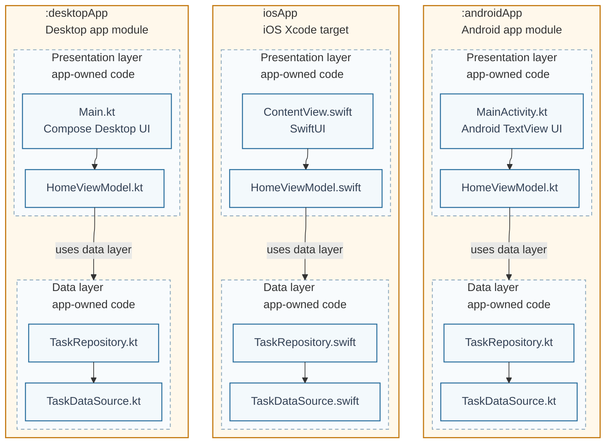

# 04. Layered Native

Baseline layered architecture. Each app target owns presentation and data layers. These layers are app-owned code groupings, not separate build modules. Presentation contains UI and ViewModel; there is no domain/use-case layer in this scenario.

