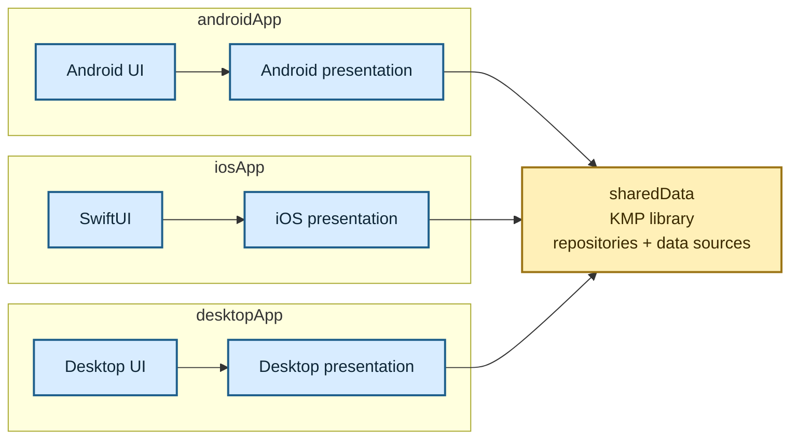

# 05. KMP Data Layer

The data layer is shared in a KMP library. UI and presentation remain platform-specific.

```mermaid
flowchart LR
  SharedData["sharedData\nKMP library\nrepositories + data sources"]

  subgraph Android["androidApp"]
    AUI["Android UI"]
    APresentation["Android presentation"]
    AUI --> APresentation
  end

  subgraph IOS["iosApp"]
    IUI["SwiftUI"]
    IPresentation["iOS presentation"]
    IUI --> IPresentation
  end

  subgraph Desktop["desktopApp"]
    DUI["Desktop UI"]
    DPresentation["Desktop presentation"]
    DUI --> DPresentation
  end

  APresentation --> SharedData
  IPresentation --> SharedData
  DPresentation --> SharedData

  classDef app fill:#d8ecff,stroke:#1f5f8b,color:#0f2738,stroke-width:2px;
  classDef shared fill:#fff0b8,stroke:#9b7415,color:#3b2a00,stroke-width:2px;
  class AUI,APresentation,IUI,IPresentation,DUI,DPresentation app;
  class SharedData shared;
```

