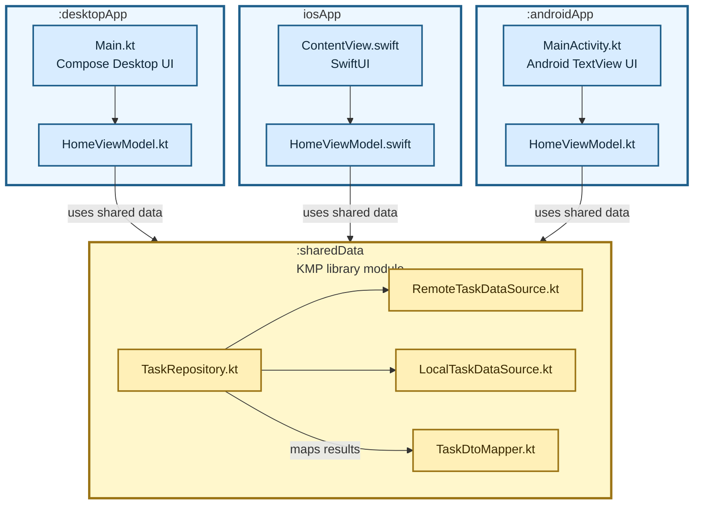

# 05. KMP Data Layer

The data layer is shared in a KMP module. Each app target keeps native presentation code: UI plus ViewModel.

```mermaid
flowchart TB
  subgraph Android[":androidApp\nAndroid app module"]
    direction TB
    AUI["MainActivity.kt\nAndroid TextView UI"]
    AVM["HomeViewModel.kt"]
    AUI --> AVM
  end

  subgraph IOS["iosApp\niOS Xcode target"]
    direction TB
    IUI["ContentView.swift\nSwiftUI"]
    IVM["HomeViewModel.swift"]
    IUI --> IVM
  end

  subgraph Desktop[":desktopApp\nDesktop app module"]
    direction TB
    DUI["Main.kt\nCompose Desktop UI"]
    DVM["HomeViewModel.kt"]
    DUI --> DVM
  end

  subgraph KMP[":sharedData\nKMP library module"]
    direction LR
    Repository["TaskRepository.kt"]
    Remote["RemoteTaskDataSource.kt"]
    Cache["LocalTaskDataSource.kt"]
    Mapper["TaskDtoMapper.kt"]
    Repository --> Remote
    Repository --> Cache
    Repository -->|"maps results"| Mapper
  end

  DVM -->|"uses shared data"| KMP
  IVM -->|"uses shared data"| KMP
  AVM -->|"uses shared data"| KMP

  classDef app fill:#d8ecff,stroke:#1f5f8b,color:#0f2738,stroke-width:2px;
  classDef kmp fill:#fff0b8,stroke:#9b7415,color:#3b2a00,stroke-width:2px;
  class AUI,AVM,IUI,IVM,DUI,DVM app;
  class Repository,Remote,Cache,Mapper kmp;
  style Android fill:#edf7ff,stroke:#1f5f8b,stroke-width:3px
  style IOS fill:#edf7ff,stroke:#1f5f8b,stroke-width:3px
  style Desktop fill:#edf7ff,stroke:#1f5f8b,stroke-width:3px
  style KMP fill:#fff7cc,stroke:#9b7415,stroke-width:3px
```
