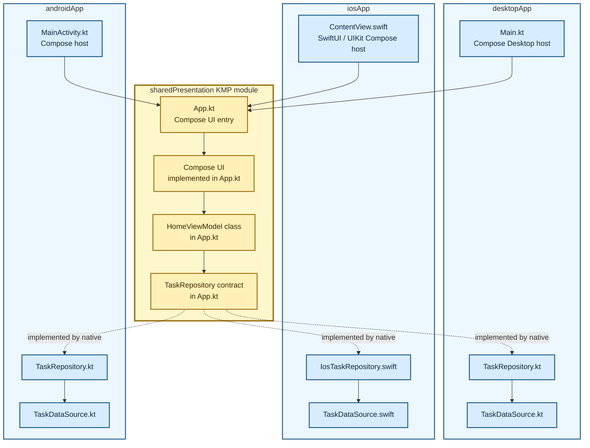

# 06. KMP Presentation Layer

Presentation is shared in a KMP module. In this two-layer scenario, presentation contains shared Compose UI and ViewModel; data remains native.

```mermaid
flowchart TB
  subgraph Desktop["desktopApp"]
    direction TB
    DEntry["Main.kt\nCompose Desktop host"]
    DRepository["TaskRepository.kt"]
    DDataSource["TaskDataSource.kt"]
    DRepository --> DDataSource
  end

  subgraph IOS["iosApp"]
    direction TB
    IEntry["ContentView.swift\nSwiftUI / UIKit Compose host"]
    IRepository["IosTaskRepository.swift"]
    IDataSource["TaskDataSource.swift"]
    IRepository --> IDataSource
  end

  subgraph Android["androidApp"]
    direction TB
    AEntry["MainActivity.kt\nCompose host"]
    ARepository["TaskRepository.kt"]
    ADataSource["TaskDataSource.kt"]
    ARepository --> ADataSource
  end

  subgraph KMP["sharedPresentation KMP module"]
    direction LR
    App["App.kt\nCompose UI entry"]
    Screen["Compose UI\nimplemented in App.kt"]
    VM["HomeViewModel class\nin App.kt"]
    RepositoryPort["TaskRepository contract\nin App.kt"]
    App --> Screen --> VM --> RepositoryPort
  end

  AEntry --> App
  IEntry --> App
  DEntry --> App
  RepositoryPort -. "implemented by native" .-> ARepository
  RepositoryPort -. "implemented by native" .-> IRepository
  RepositoryPort -. "implemented by native" .-> DRepository

  classDef app fill:#d8ecff,stroke:#1f5f8b,color:#0f2738,stroke-width:2px;
  classDef kmp fill:#fff0b8,stroke:#9b7415,color:#3b2a00,stroke-width:2px;
  class AEntry,ARepository,ADataSource,IEntry,IRepository,IDataSource,DEntry,DRepository,DDataSource app;
  class App,Screen,VM,RepositoryPort kmp;
  style Android fill:#edf7ff,stroke:#1f5f8b,stroke-width:2px
  style IOS fill:#edf7ff,stroke:#1f5f8b,stroke-width:2px
  style Desktop fill:#edf7ff,stroke:#1f5f8b,stroke-width:2px
  style KMP fill:#fff7cc,stroke:#9b7415,stroke-width:3px
```
