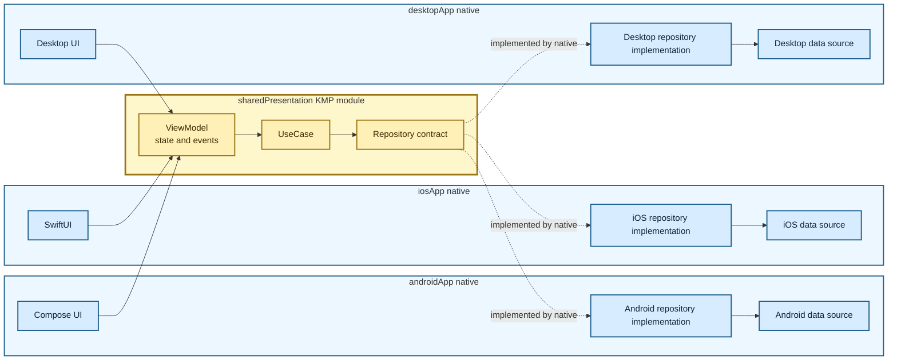

# 06. KMP Presentation Layer

Presentation state and actions are shared. UI and data implementations remain platform-specific.

```mermaid
flowchart LR
  subgraph Android["androidApp native"]
    AndroidUI["Compose UI"]
    AndroidData["Android repository implementation"]
    AndroidSource["Android data source"]
    AndroidData --> AndroidSource
  end

  subgraph IOS["iosApp native"]
    IOSUI["SwiftUI"]
    IOSData["iOS repository implementation"]
    IOSSource["iOS data source"]
    IOSData --> IOSSource
  end

  subgraph Desktop["desktopApp native"]
    DesktopUI["Desktop UI"]
    DesktopData["Desktop repository implementation"]
    DesktopSource["Desktop data source"]
    DesktopData --> DesktopSource
  end

  subgraph KMP["sharedPresentation KMP module"]
    direction LR
    VM["ViewModel\nstate and events"]
    UseCase["UseCase"]
    RepositoryPort["Repository contract"]
    VM --> UseCase --> RepositoryPort
  end

  AndroidUI --> VM
  IOSUI --> VM
  DesktopUI --> VM

  RepositoryPort -. "implemented by native" .-> AndroidData
  RepositoryPort -. "implemented by native" .-> IOSData
  RepositoryPort -. "implemented by native" .-> DesktopData

  classDef app fill:#d8ecff,stroke:#1f5f8b,color:#0f2738,stroke-width:2px;
  classDef kmp fill:#fff0b8,stroke:#9b7415,color:#3b2a00,stroke-width:2px;
  class AndroidUI,AndroidData,AndroidSource,IOSUI,IOSData,IOSSource,DesktopUI,DesktopData,DesktopSource app;
  class VM,UseCase,RepositoryPort kmp;
  style Android fill:#edf7ff,stroke:#1f5f8b,stroke-width:2px
  style IOS fill:#edf7ff,stroke:#1f5f8b,stroke-width:2px
  style Desktop fill:#edf7ff,stroke:#1f5f8b,stroke-width:2px
  style KMP fill:#fff7cc,stroke:#9b7415,stroke-width:3px
```
