# 06. KMP Presentation Layer

Presentation is shared in a KMP module. In this two-layer scenario, presentation contains shared Compose UI and ViewModel; data remains native.

[Full SVG](images/06-kmp-presentation-layer.svg) · [PNG @2x](images/06-kmp-presentation-layer@2x.png) · [Preview PNG @2x](previews/06-kmp-presentation-layer@2x.png)

[Diagram specification](specs/06-kmp-presentation-layer.json) · [Runnable sample](../samples/06_kmp-presentation-layer/)
