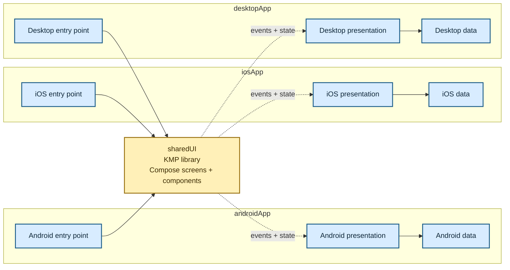

# 07. KMP UI Layer

Only the UI layer is shared with Compose Multiplatform. Presentation and data are provided by each app.

```mermaid
flowchart LR
  SharedUI["sharedUI\nKMP library\nCompose screens + components"]

  subgraph Android["androidApp"]
    AHost["Android entry point"]
    APresentation["Android presentation"]
    AData["Android data"]
    APresentation --> AData
  end

  subgraph IOS["iosApp"]
    IHost["iOS entry point"]
    IPresentation["iOS presentation"]
    IData["iOS data"]
    IPresentation --> IData
  end

  subgraph Desktop["desktopApp"]
    DHost["Desktop entry point"]
    DPresentation["Desktop presentation"]
    DData["Desktop data"]
    DPresentation --> DData
  end

  AHost --> SharedUI
  IHost --> SharedUI
  DHost --> SharedUI
  SharedUI -. "events + state" .-> APresentation
  SharedUI -. "events + state" .-> IPresentation
  SharedUI -. "events + state" .-> DPresentation

  classDef app fill:#d8ecff,stroke:#1f5f8b,color:#0f2738,stroke-width:2px;
  classDef shared fill:#fff0b8,stroke:#9b7415,color:#3b2a00,stroke-width:2px;
  class AHost,APresentation,AData,IHost,IPresentation,IData,DHost,DPresentation,DData app;
  class SharedUI shared;
```
