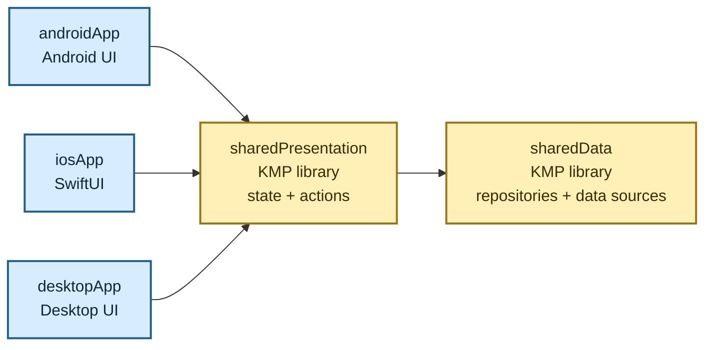

# 08. KMP Presentation And Data Layers

Presentation and data are shared. Platform app modules keep the entry points and host the UI.

```mermaid
flowchart LR
  SharedPresentation["sharedPresentation\nKMP library\nstate + actions"]
  SharedData["sharedData\nKMP library\nrepositories + data sources"]
  SharedPresentation --> SharedData

  Android["androidApp\nAndroid UI"]
  IOS["iosApp\nSwiftUI"]
  Desktop["desktopApp\nDesktop UI"]

  Android --> SharedPresentation
  IOS --> SharedPresentation
  Desktop --> SharedPresentation

  classDef app fill:#d8ecff,stroke:#1f5f8b,color:#0f2738,stroke-width:2px;
  classDef shared fill:#fff0b8,stroke:#9b7415,color:#3b2a00,stroke-width:2px;
  class Android,IOS,Desktop app;
  class SharedPresentation,SharedData shared;
```

