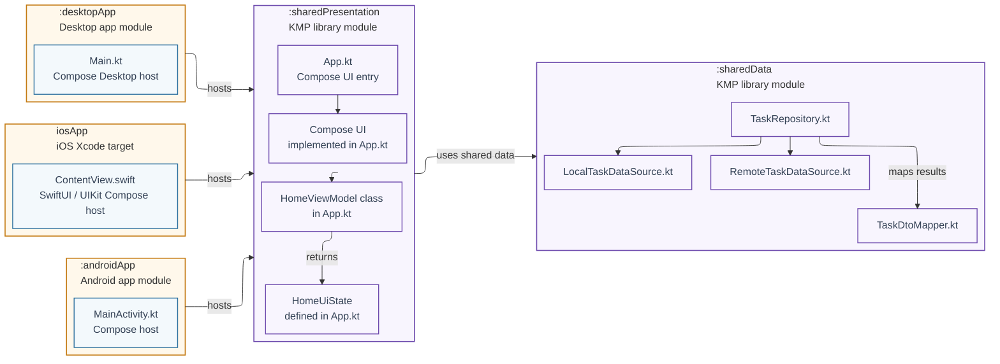

# 08. KMP Presentation And Data Layers

Presentation and data are shared. Presentation contains Compose UI and ViewModel; data contains repository and data sources.

```mermaid
---
config:
  layout: elk
  elk:
    nodePlacementStrategy: LINEAR_SEGMENTS
---
flowchart LR
  subgraph Android[":androidApp\nAndroid app module"]
    direction TB
    AndroidEntry["MainActivity.kt\nCompose host"]
  end

  subgraph IOS["iosApp\niOS Xcode target"]
    direction TB
    IOSEntry["ContentView.swift\nSwiftUI / UIKit Compose host"]
  end

  subgraph Desktop[":desktopApp\nDesktop app module"]
    direction TB
    DesktopEntry["Main.kt\nCompose Desktop host"]
  end

  subgraph Presentation[":sharedPresentation\nKMP library module"]
    direction TB
    App["App.kt\nCompose UI entry"]
    Screen["Compose UI\nimplemented in App.kt"]
    VM["HomeViewModel class\nin App.kt"]
    State["HomeUiState\ndefined in App.kt"]
    App --> Screen --> VM
    VM -->|"returns"| State
  end

  subgraph Data[":sharedData\nKMP library module"]
    direction TB
    Repository["TaskRepository.kt"]
    Remote["RemoteTaskDataSource.kt"]
    Cache["LocalTaskDataSource.kt"]
    Mapper["TaskDtoMapper.kt"]
    Repository --> Remote
    Repository --> Cache
    Repository -->|"maps results"| Mapper
  end

  Desktop -->|"hosts"| Presentation
  IOS -->|"hosts"| Presentation
  Android -->|"hosts"| Presentation
  Presentation -->|"uses shared data"| Data

  classDef app fill:#f3f9fc,stroke:#2b6f9e,color:#334155,stroke-width:1.4px;
  classDef kmp fill:#f8f5fe,stroke:#6e4bae,color:#334155,stroke-width:1.4px;
  class AndroidEntry,IOSEntry,DesktopEntry app;
  class App,Screen,VM,State,Repository,Remote,Cache,Mapper kmp;
  style Android fill:#fff8eb,stroke:#c47a12,stroke-width:1.6px
  style IOS fill:#fff8eb,stroke:#c47a12,stroke-width:1.6px
  style Desktop fill:#fff8eb,stroke:#c47a12,stroke-width:1.6px
  style Presentation fill:#f8f5fe,stroke:#6e4bae,stroke-width:1.6px
  style Data fill:#f8f5fe,stroke:#6e4bae,stroke-width:1.6px
```
