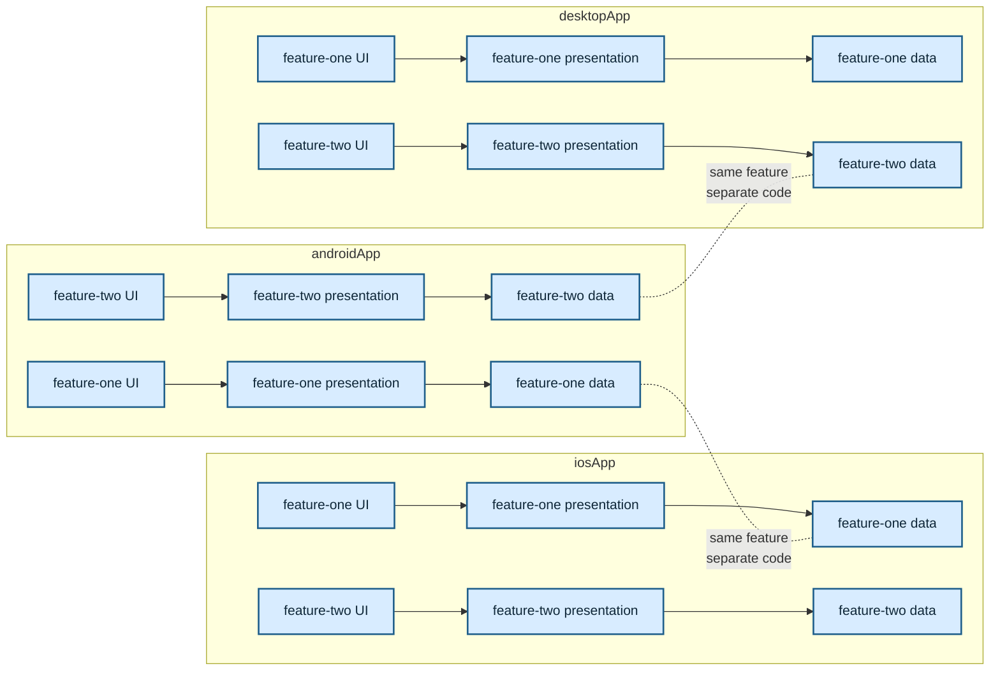

# 09. Modular Native

Baseline modular architecture. Feature modules are duplicated per platform with no shared KMP code.

```mermaid
flowchart LR
  subgraph Android["androidApp"]
    AF1UI["feature-one UI"]
    AF1P["feature-one presentation"]
    AF1D["feature-one data"]
    AF2UI["feature-two UI"]
    AF2P["feature-two presentation"]
    AF2D["feature-two data"]
    AF1UI --> AF1P --> AF1D
    AF2UI --> AF2P --> AF2D
  end

  subgraph IOS["iosApp"]
    IF1UI["feature-one UI"]
    IF1P["feature-one presentation"]
    IF1D["feature-one data"]
    IF2UI["feature-two UI"]
    IF2P["feature-two presentation"]
    IF2D["feature-two data"]
    IF1UI --> IF1P --> IF1D
    IF2UI --> IF2P --> IF2D
  end

  subgraph Desktop["desktopApp"]
    DF1UI["feature-one UI"]
    DF1P["feature-one presentation"]
    DF1D["feature-one data"]
    DF2UI["feature-two UI"]
    DF2P["feature-two presentation"]
    DF2D["feature-two data"]
    DF1UI --> DF1P --> DF1D
    DF2UI --> DF2P --> DF2D
  end

  AF1D -. "same feature\nseparate code" .- IF1D
  AF2D -. "same feature\nseparate code" .- DF2D

  classDef app fill:#d8ecff,stroke:#1f5f8b,color:#0f2738,stroke-width:2px;
  class AF1UI,AF1P,AF1D,AF2UI,AF2P,AF2D,IF1UI,IF1P,IF1D,IF2UI,IF2P,IF2D,DF1UI,DF1P,DF1D,DF2UI,DF2P,DF2D app;
```
