# 09. Modular Native

Baseline modular architecture. Each app target groups feature-specific native code inside the platform app. The feature boundaries shown here are conceptual; they are not separate build modules.

```mermaid
---
config:
  layout: elk
  elk:
    nodePlacementStrategy: LINEAR_SEGMENTS
---
flowchart TB
  subgraph Android[":androidApp\nAndroid app module"]
    direction LR
    subgraph AF1["Feature 1\napp-owned code"]
      direction TB
      AF1UI["Feature One UI content\nMainActivity.kt · TextView"]
      AF1VM["HomeViewModel.kt"]
      AF1Repo["TaskRepository.kt"]
      AF1Source["TaskDataSource.kt"]
      AF1UI --> AF1VM --> AF1Repo --> AF1Source
    end
    subgraph AF2["Feature 2\napp-owned code"]
      direction TB
      AF2UI["Feature Two UI content\nMainActivity.kt · TextView"]
      AF2VM["DetailsViewModel.kt"]
      AF2Repo["DetailsRepository.kt"]
      AF2Source["DetailsDataSource.kt"]
      AF2UI --> AF2VM --> AF2Repo --> AF2Source
    end
  end

  subgraph IOS["iosApp\niOS Xcode target"]
    direction LR
    subgraph IF1["Feature 1\napp-owned code"]
      direction TB
      IF1UI["Feature One UI content\nContentView.swift · SwiftUI"]
      IF1VM["HomeViewModel.swift"]
      IF1Repo["TaskRepository.swift"]
      IF1Source["TaskDataSource.swift"]
      IF1UI --> IF1VM --> IF1Repo --> IF1Source
    end
    subgraph IF2["Feature 2\napp-owned code"]
      direction TB
      IF2UI["Feature Two UI content\nContentView.swift · SwiftUI"]
      IF2VM["DetailsViewModel.swift"]
      IF2Repo["DetailsRepository.swift"]
      IF2Source["DetailsDataSource.swift"]
      IF2UI --> IF2VM --> IF2Repo --> IF2Source
    end
  end

  subgraph Desktop[":desktopApp\nDesktop app module"]
    direction LR
    subgraph DF1["Feature 1\napp-owned code"]
      direction TB
      DF1UI["Feature One UI content\nMain.kt · Compose Desktop"]
      DF1VM["HomeViewModel.kt"]
      DF1Repo["TaskRepository.kt"]
      DF1Source["TaskDataSource.kt"]
      DF1UI --> DF1VM --> DF1Repo --> DF1Source
    end
    subgraph DF2["Feature 2\napp-owned code"]
      direction TB
      DF2UI["Feature Two UI content\nMain.kt · Compose Desktop"]
      DF2VM["DetailsViewModel.kt"]
      DF2Repo["DetailsRepository.kt"]
      DF2Source["DetailsDataSource.kt"]
      DF2UI --> DF2VM --> DF2Repo --> DF2Source
    end
  end

  classDef native fill:#d8ecff,stroke:#1f5f8b,color:#0f2738,stroke-width:2px;
  class AF1UI,AF1VM,AF1Repo,AF1Source,AF2UI,AF2VM,AF2Repo,AF2Source,IF1UI,IF1VM,IF1Repo,IF1Source,IF2UI,IF2VM,IF2Repo,IF2Source,DF1UI,DF1VM,DF1Repo,DF1Source,DF2UI,DF2VM,DF2Repo,DF2Source native;
  style Android fill:#edf7ff,stroke:#1f5f8b,stroke-width:3px
  style IOS fill:#edf7ff,stroke:#1f5f8b,stroke-width:3px
  style Desktop fill:#edf7ff,stroke:#1f5f8b,stroke-width:3px
  style AF1 fill:#f6fbff,stroke:#5f97bd,stroke-width:1.5px,stroke-dasharray:6 4
  style AF2 fill:#f6fbff,stroke:#5f97bd,stroke-width:1.5px,stroke-dasharray:6 4
  style IF1 fill:#f6fbff,stroke:#5f97bd,stroke-width:1.5px,stroke-dasharray:6 4
  style IF2 fill:#f6fbff,stroke:#5f97bd,stroke-width:1.5px,stroke-dasharray:6 4
  style DF1 fill:#f6fbff,stroke:#5f97bd,stroke-width:1.5px,stroke-dasharray:6 4
  style DF2 fill:#f6fbff,stroke:#5f97bd,stroke-width:1.5px,stroke-dasharray:6 4
```

