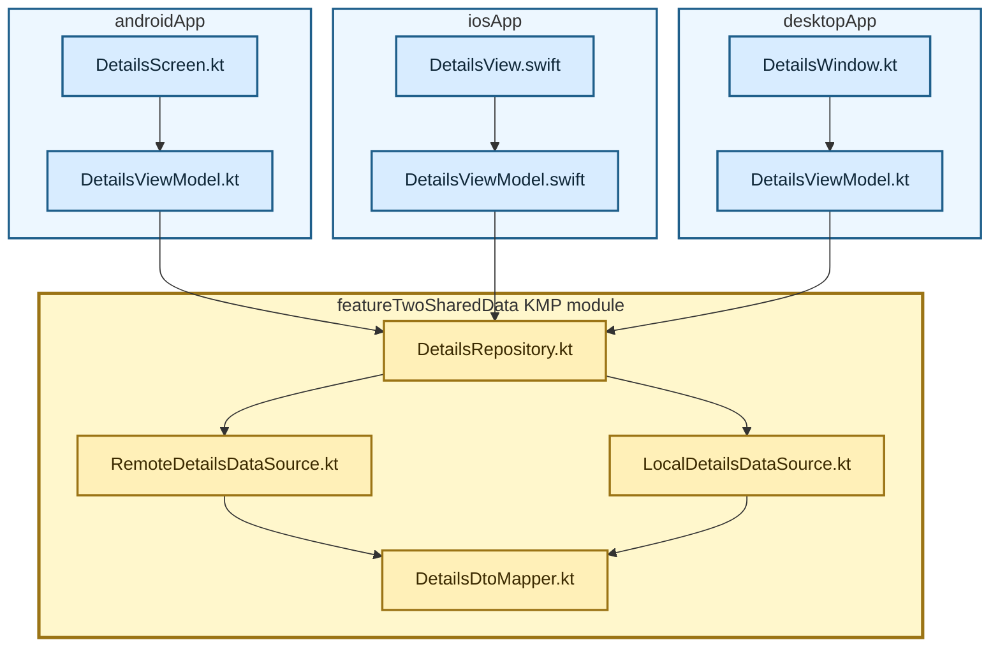

# 10. Modular KMP Data Layer

Feature two shares only its data layer. Feature two presentation remains native in each app target.

```mermaid
flowchart TB
  subgraph Android["androidApp"]
    direction TB
    AUI["DetailsScreen.kt"]
    AVM["DetailsViewModel.kt"]
    AUI --> AVM
  end

  subgraph IOS["iosApp"]
    direction TB
    IUI["DetailsView.swift"]
    IVM["DetailsViewModel.swift"]
    IUI --> IVM
  end

  subgraph Desktop["desktopApp"]
    direction TB
    DUI["DetailsWindow.kt"]
    DVM["DetailsViewModel.kt"]
    DUI --> DVM
  end

  subgraph KMP["featureTwoSharedData KMP module"]
    direction LR
    Repository["DetailsRepository.kt"]
    Remote["RemoteDetailsDataSource.kt"]
    Cache["LocalDetailsDataSource.kt"]
    Mapper["DetailsDtoMapper.kt"]
    Repository --> Remote
    Repository --> Cache
    Remote --> Mapper
    Cache --> Mapper
  end

  AVM --> Repository
  IVM --> Repository
  DVM --> Repository

  classDef app fill:#d8ecff,stroke:#1f5f8b,color:#0f2738,stroke-width:2px;
  classDef kmp fill:#fff0b8,stroke:#9b7415,color:#3b2a00,stroke-width:2px;
  class AUI,AVM,IUI,IVM,DUI,DVM app;
  class Repository,Remote,Cache,Mapper kmp;
  style Android fill:#edf7ff,stroke:#1f5f8b,stroke-width:2px
  style IOS fill:#edf7ff,stroke:#1f5f8b,stroke-width:2px
  style Desktop fill:#edf7ff,stroke:#1f5f8b,stroke-width:2px
  style KMP fill:#fff7cc,stroke:#9b7415,stroke-width:3px
```
