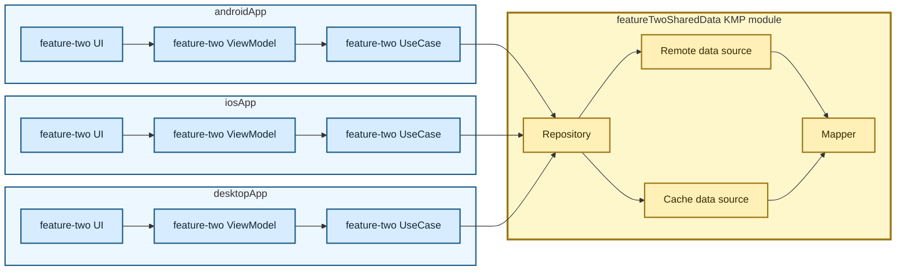

# 10. Modular KMP Data Layer

Feature two shares only its data layer. Feature one remains platform-specific.

```mermaid
flowchart LR
  subgraph Android["androidApp"]
    AF2UI["feature-two UI"]
    AF2VM["feature-two ViewModel"]
    AF2UseCase["feature-two UseCase"]
    AF2UI --> AF2VM --> AF2UseCase
  end

  subgraph IOS["iosApp"]
    IF2UI["feature-two UI"]
    IF2VM["feature-two ViewModel"]
    IF2UseCase["feature-two UseCase"]
    IF2UI --> IF2VM --> IF2UseCase
  end

  subgraph Desktop["desktopApp"]
    DF2UI["feature-two UI"]
    DF2VM["feature-two ViewModel"]
    DF2UseCase["feature-two UseCase"]
    DF2UI --> DF2VM --> DF2UseCase
  end

  subgraph KMP["featureTwoSharedData KMP module"]
    direction LR
    Repository["Repository"]
    Remote["Remote data source"]
    Cache["Cache data source"]
    Mapper["Mapper"]
    Repository --> Remote
    Repository --> Cache
    Remote --> Mapper
    Cache --> Mapper
  end

  AF2UseCase --> Repository
  IF2UseCase --> Repository
  DF2UseCase --> Repository

  classDef app fill:#d8ecff,stroke:#1f5f8b,color:#0f2738,stroke-width:2px;
  classDef kmp fill:#fff0b8,stroke:#9b7415,color:#3b2a00,stroke-width:2px;
  class AF2UI,AF2VM,AF2UseCase,IF2UI,IF2VM,IF2UseCase,DF2UI,DF2VM,DF2UseCase app;
  class Repository,Remote,Cache,Mapper kmp;
  style Android fill:#edf7ff,stroke:#1f5f8b,stroke-width:2px
  style IOS fill:#edf7ff,stroke:#1f5f8b,stroke-width:2px
  style Desktop fill:#edf7ff,stroke:#1f5f8b,stroke-width:2px
  style KMP fill:#fff7cc,stroke:#9b7415,stroke-width:3px
```
