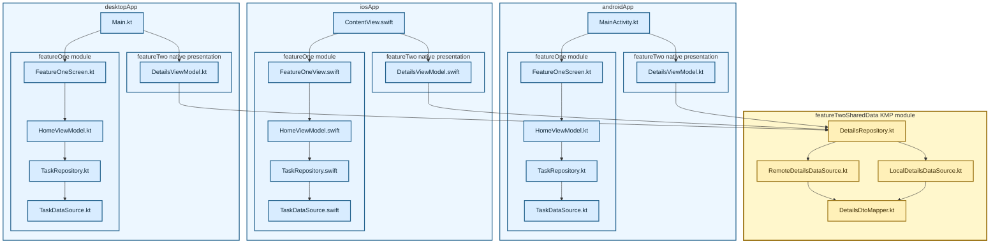

# 10. Modular KMP Data Layer

Feature one stays native in every platform module. Feature two shares only its data layer; feature two presentation remains native in each app target.

```mermaid
flowchart TB
  subgraph Android["androidApp"]
    direction TB
    AEntry["MainActivity.kt"]
    subgraph AFeatureOne["featureOne module"]
      direction TB
      AHomeUI["FeatureOneScreen.kt"]
      AHomeVM["HomeViewModel.kt"]
      ATaskRepository["TaskRepository.kt"]
      ATaskDataSource["TaskDataSource.kt"]
      AHomeUI --> AHomeVM --> ATaskRepository --> ATaskDataSource
    end
    subgraph AFeatureTwo["featureTwo native presentation"]
      direction TB
      ADetailsVM["DetailsViewModel.kt"]
    end
    AEntry --> AHomeUI
    AEntry --> ADetailsVM
  end

  subgraph IOS["iosApp"]
    direction TB
    IEntry["ContentView.swift"]
    subgraph IFeatureOne["featureOne module"]
      direction TB
      IHomeUI["FeatureOneView.swift"]
      IHomeVM["HomeViewModel.swift"]
      ITaskRepository["TaskRepository.swift"]
      ITaskDataSource["TaskDataSource.swift"]
      IHomeUI --> IHomeVM --> ITaskRepository --> ITaskDataSource
    end
    subgraph IFeatureTwo["featureTwo native presentation"]
      direction TB
      IDetailsVM["DetailsViewModel.swift"]
    end
    IEntry --> IHomeUI
    IEntry --> IDetailsVM
  end

  subgraph Desktop["desktopApp"]
    direction TB
    DEntry["Main.kt"]
    subgraph DFeatureOne["featureOne module"]
      direction TB
      DHomeUI["FeatureOneScreen.kt"]
      DHomeVM["HomeViewModel.kt"]
      DTaskRepository["TaskRepository.kt"]
      DTaskDataSource["TaskDataSource.kt"]
      DHomeUI --> DHomeVM --> DTaskRepository --> DTaskDataSource
    end
    subgraph DFeatureTwo["featureTwo native presentation"]
      direction TB
      DDetailsVM["DetailsViewModel.kt"]
    end
    DEntry --> DHomeUI
    DEntry --> DDetailsVM
  end

  subgraph KMP["featureTwoSharedData KMP module"]
    direction LR
    Repository["DetailsRepository.kt"]
    Remote["RemoteDetailsDataSource.kt"]
    Cache["LocalDetailsDataSource.kt"]
    Mapper["DetailsDtoMapper.kt"]
    Repository --> Remote
    Repository --> Cache
    Remote --> Mapper
    Cache --> Mapper
  end

  ADetailsVM --> Repository
  IDetailsVM --> Repository
  DDetailsVM --> Repository

  classDef app fill:#d8ecff,stroke:#1f5f8b,color:#0f2738,stroke-width:2px;
  classDef kmp fill:#fff0b8,stroke:#9b7415,color:#3b2a00,stroke-width:2px;
  class AEntry,AHomeUI,AHomeVM,ATaskRepository,ATaskDataSource,ADetailsVM,IEntry,IHomeUI,IHomeVM,ITaskRepository,ITaskDataSource,IDetailsVM,DEntry,DHomeUI,DHomeVM,DTaskRepository,DTaskDataSource,DDetailsVM app;
  class Repository,Remote,Cache,Mapper kmp;
  style Android fill:#edf7ff,stroke:#1f5f8b,stroke-width:2px
  style IOS fill:#edf7ff,stroke:#1f5f8b,stroke-width:2px
  style Desktop fill:#edf7ff,stroke:#1f5f8b,stroke-width:2px
  style AFeatureOne fill:#e8f4ff,stroke:#1f5f8b,stroke-width:2px
  style AFeatureTwo fill:#e8f4ff,stroke:#1f5f8b,stroke-width:2px
  style IFeatureOne fill:#e8f4ff,stroke:#1f5f8b,stroke-width:2px
  style IFeatureTwo fill:#e8f4ff,stroke:#1f5f8b,stroke-width:2px
  style DFeatureOne fill:#e8f4ff,stroke:#1f5f8b,stroke-width:2px
  style DFeatureTwo fill:#e8f4ff,stroke:#1f5f8b,stroke-width:2px
  style KMP fill:#fff7cc,stroke:#9b7415,stroke-width:3px
```
