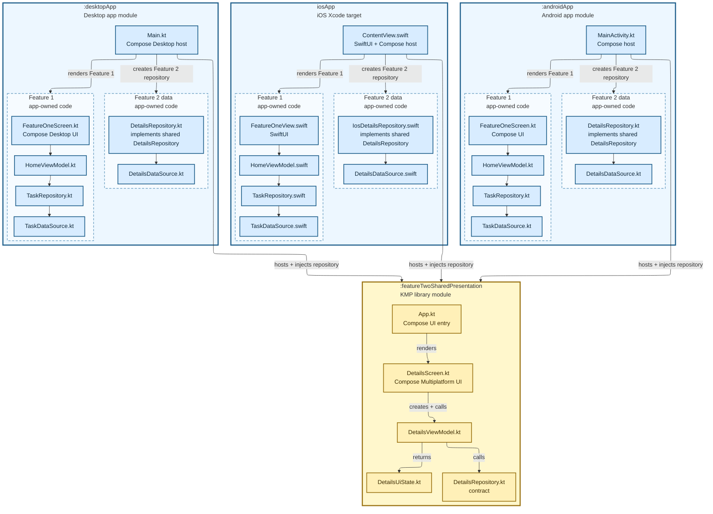

# 11. Modular KMP Presentation Layer

Feature one stays native inside every platform app. Feature two shares presentation as a KMP module; feature two data remains native.

```mermaid
---
config:
  layout: elk
  elk:
    nodePlacementStrategy: LINEAR_SEGMENTS
---
flowchart TB
  subgraph Android[":androidApp\nAndroid app module"]
    direction TB
    AEntry["MainActivity.kt\nCompose host"]
    subgraph AFeatureOne["Feature 1\napp-owned code"]
      direction TB
      AHomeUI["FeatureOneScreen.kt\nCompose UI"]
      AHomeVM["HomeViewModel.kt"]
      ATaskRepository["TaskRepository.kt"]
      ATaskDataSource["TaskDataSource.kt"]
      AHomeUI --> AHomeVM --> ATaskRepository --> ATaskDataSource
    end
    subgraph AFeatureTwo["Feature 2 data\napp-owned code"]
      direction TB
      ADetailsRepository["DetailsRepository.kt\nimplements shared DetailsRepository"]
      ADetailsDataSource["DetailsDataSource.kt"]
      ADetailsRepository --> ADetailsDataSource
    end
    AEntry -->|"renders Feature 1"| AFeatureOne
    AEntry -->|"creates Feature 2 repository"| AFeatureTwo
  end

  subgraph IOS["iosApp\niOS Xcode target"]
    direction TB
    IEntry["ContentView.swift\nSwiftUI + Compose host"]
    subgraph IFeatureOne["Feature 1\napp-owned code"]
      direction TB
      IHomeUI["FeatureOneView.swift\nSwiftUI"]
      IHomeVM["HomeViewModel.swift"]
      ITaskRepository["TaskRepository.swift"]
      ITaskDataSource["TaskDataSource.swift"]
      IHomeUI --> IHomeVM --> ITaskRepository --> ITaskDataSource
    end
    subgraph IFeatureTwo["Feature 2 data\napp-owned code"]
      direction TB
      IDetailsRepository["IosDetailsRepository.swift\nimplements shared DetailsRepository"]
      IDetailsDataSource["DetailsDataSource.swift"]
      IDetailsRepository --> IDetailsDataSource
    end
    IEntry -->|"renders Feature 1"| IFeatureOne
    IEntry -->|"creates Feature 2 repository"| IFeatureTwo
  end

  subgraph Desktop[":desktopApp\nDesktop app module"]
    direction TB
    DEntry["Main.kt\nCompose Desktop host"]
    subgraph DFeatureOne["Feature 1\napp-owned code"]
      direction TB
      DHomeUI["FeatureOneScreen.kt\nCompose Desktop UI"]
      DHomeVM["HomeViewModel.kt"]
      DTaskRepository["TaskRepository.kt"]
      DTaskDataSource["TaskDataSource.kt"]
      DHomeUI --> DHomeVM --> DTaskRepository --> DTaskDataSource
    end
    subgraph DFeatureTwo["Feature 2 data\napp-owned code"]
      direction TB
      DDetailsRepository["DetailsRepository.kt\nimplements shared DetailsRepository"]
      DDetailsDataSource["DetailsDataSource.kt"]
      DDetailsRepository --> DDetailsDataSource
    end
    DEntry -->|"renders Feature 1"| DFeatureOne
    DEntry -->|"creates Feature 2 repository"| DFeatureTwo
  end

  subgraph KMP[":featureTwoSharedPresentation\nKMP library module"]
    direction TB
    App["App.kt\nCompose UI entry"]
    Screen["DetailsScreen.kt\nCompose Multiplatform UI"]
    State["DetailsUiState.kt"]
    VM["DetailsViewModel.kt"]
    RepositoryPort["DetailsRepository.kt\ncontract"]
    App -->|"renders"| Screen
    Screen -->|"creates + calls"| VM
    VM -->|"returns"| State
    VM -->|"calls"| RepositoryPort
  end

  DEntry -->|"hosts + injects repository"| KMP
  IEntry -->|"hosts + injects repository"| KMP
  AEntry -->|"hosts + injects repository"| KMP

  classDef app fill:#d8ecff,stroke:#1f5f8b,color:#0f2738,stroke-width:2px;
  classDef kmp fill:#fff0b8,stroke:#9b7415,color:#3b2a00,stroke-width:2px;
  class AEntry,AHomeUI,AHomeVM,ATaskRepository,ATaskDataSource,ADetailsRepository,ADetailsDataSource,IEntry,IHomeUI,IHomeVM,ITaskRepository,ITaskDataSource,IDetailsRepository,IDetailsDataSource,DEntry,DHomeUI,DHomeVM,DTaskRepository,DTaskDataSource,DDetailsRepository,DDetailsDataSource app;
  class App,Screen,State,VM,RepositoryPort kmp;
  style Android fill:#edf7ff,stroke:#1f5f8b,stroke-width:3px
  style IOS fill:#edf7ff,stroke:#1f5f8b,stroke-width:3px
  style Desktop fill:#edf7ff,stroke:#1f5f8b,stroke-width:3px
  style AFeatureOne fill:#f6fbff,stroke:#5f97bd,stroke-width:1.5px,stroke-dasharray:6 4
  style AFeatureTwo fill:#f6fbff,stroke:#5f97bd,stroke-width:1.5px,stroke-dasharray:6 4
  style IFeatureOne fill:#f6fbff,stroke:#5f97bd,stroke-width:1.5px,stroke-dasharray:6 4
  style IFeatureTwo fill:#f6fbff,stroke:#5f97bd,stroke-width:1.5px,stroke-dasharray:6 4
  style DFeatureOne fill:#f6fbff,stroke:#5f97bd,stroke-width:1.5px,stroke-dasharray:6 4
  style DFeatureTwo fill:#f6fbff,stroke:#5f97bd,stroke-width:1.5px,stroke-dasharray:6 4
  style KMP fill:#fff7cc,stroke:#9b7415,stroke-width:3px
```
