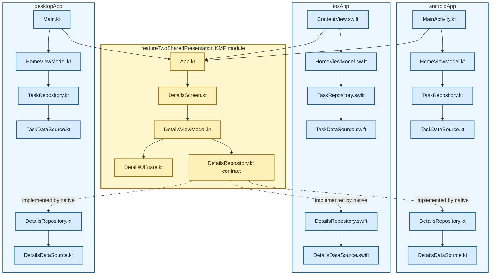

# 11. Modular KMP Presentation Layer

Feature one stays native in every platform module. Feature two shares presentation as a KMP module; feature two data remains native.

```mermaid
flowchart TB
  subgraph Android["androidApp"]
    direction TB
    AEntry["MainActivity.kt"]
    AHomeVM["HomeViewModel.kt"]
    ATaskRepository["TaskRepository.kt"]
    ATaskDataSource["TaskDataSource.kt"]
    ADetailsRepository["DetailsRepository.kt"]
    ADetailsDataSource["DetailsDataSource.kt"]
    AEntry --> AHomeVM --> ATaskRepository --> ATaskDataSource
    ADetailsRepository --> ADetailsDataSource
  end

  subgraph IOS["iosApp"]
    direction TB
    IEntry["ContentView.swift"]
    IHomeVM["HomeViewModel.swift"]
    ITaskRepository["TaskRepository.swift"]
    ITaskDataSource["TaskDataSource.swift"]
    IDetailsRepository["DetailsRepository.swift"]
    IDetailsDataSource["DetailsDataSource.swift"]
    IEntry --> IHomeVM --> ITaskRepository --> ITaskDataSource
    IDetailsRepository --> IDetailsDataSource
  end

  subgraph Desktop["desktopApp"]
    direction TB
    DEntry["Main.kt"]
    DHomeVM["HomeViewModel.kt"]
    DTaskRepository["TaskRepository.kt"]
    DTaskDataSource["TaskDataSource.kt"]
    DDetailsRepository["DetailsRepository.kt"]
    DDetailsDataSource["DetailsDataSource.kt"]
    DEntry --> DHomeVM --> DTaskRepository --> DTaskDataSource
    DDetailsRepository --> DDetailsDataSource
  end

  subgraph KMP["featureTwoSharedPresentation KMP module"]
    direction LR
    App["App.kt"]
    Screen["DetailsScreen.kt"]
    State["DetailsUiState.kt"]
    VM["DetailsViewModel.kt"]
    RepositoryPort["DetailsRepository.kt contract"]
    App --> Screen --> VM
    VM --> State
    VM --> RepositoryPort
  end

  AEntry --> App
  IEntry --> App
  DEntry --> App
  RepositoryPort -. "implemented by native" .-> ADetailsRepository
  RepositoryPort -. "implemented by native" .-> IDetailsRepository
  RepositoryPort -. "implemented by native" .-> DDetailsRepository

  classDef app fill:#d8ecff,stroke:#1f5f8b,color:#0f2738,stroke-width:2px;
  classDef kmp fill:#fff0b8,stroke:#9b7415,color:#3b2a00,stroke-width:2px;
  class AEntry,AHomeVM,ATaskRepository,ATaskDataSource,ADetailsRepository,ADetailsDataSource,IEntry,IHomeVM,ITaskRepository,ITaskDataSource,IDetailsRepository,IDetailsDataSource,DEntry,DHomeVM,DTaskRepository,DTaskDataSource,DDetailsRepository,DDetailsDataSource app;
  class App,Screen,State,VM,RepositoryPort kmp;
  style Android fill:#edf7ff,stroke:#1f5f8b,stroke-width:2px
  style IOS fill:#edf7ff,stroke:#1f5f8b,stroke-width:2px
  style Desktop fill:#edf7ff,stroke:#1f5f8b,stroke-width:2px
  style KMP fill:#fff7cc,stroke:#9b7415,stroke-width:3px
```
