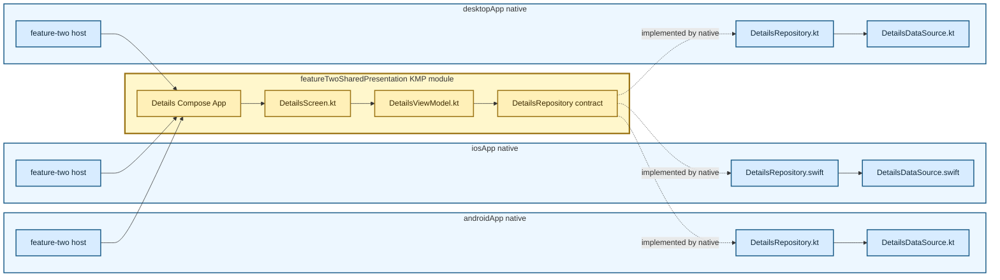

# 11. Modular KMP Presentation Layer

Feature two shares presentation as a KMP module. Presentation contains shared Compose UI and ViewModel; data remains native.

```mermaid
flowchart LR
  subgraph Android["androidApp native"]
    AHost["feature-two host"]
    ARepository["DetailsRepository.kt"]
    ADataSource["DetailsDataSource.kt"]
    ARepository --> ADataSource
  end

  subgraph IOS["iosApp native"]
    IHost["feature-two host"]
    IRepository["DetailsRepository.swift"]
    IDataSource["DetailsDataSource.swift"]
    IRepository --> IDataSource
  end

  subgraph Desktop["desktopApp native"]
    DHost["feature-two host"]
    DRepository["DetailsRepository.kt"]
    DDataSource["DetailsDataSource.kt"]
    DRepository --> DDataSource
  end

  subgraph KMP["featureTwoSharedPresentation KMP module"]
    direction LR
    App["Details Compose App"]
    Screen["DetailsScreen.kt"]
    VM["DetailsViewModel.kt"]
    RepositoryPort["DetailsRepository contract"]
    App --> Screen --> VM --> RepositoryPort
  end

  AHost --> App
  IHost --> App
  DHost --> App
  RepositoryPort -. "implemented by native" .-> ARepository
  RepositoryPort -. "implemented by native" .-> IRepository
  RepositoryPort -. "implemented by native" .-> DRepository

  classDef app fill:#d8ecff,stroke:#1f5f8b,color:#0f2738,stroke-width:2px;
  classDef kmp fill:#fff0b8,stroke:#9b7415,color:#3b2a00,stroke-width:2px;
  class AHost,ARepository,ADataSource,IHost,IRepository,IDataSource,DHost,DRepository,DDataSource app;
  class App,Screen,VM,RepositoryPort kmp;
  style Android fill:#edf7ff,stroke:#1f5f8b,stroke-width:2px
  style IOS fill:#edf7ff,stroke:#1f5f8b,stroke-width:2px
  style Desktop fill:#edf7ff,stroke:#1f5f8b,stroke-width:2px
  style KMP fill:#fff7cc,stroke:#9b7415,stroke-width:3px
```
