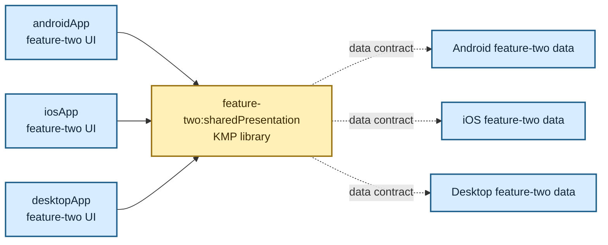

# 11. Modular KMP Presentation Layer

Feature two shares presentation logic. UI and data implementations remain platform-specific.

```mermaid
flowchart LR
  SharedF2Presentation["feature-two:sharedPresentation\nKMP library"]

  AndroidUI["androidApp\nfeature-two UI"]
  IOSUI["iosApp\nfeature-two UI"]
  DesktopUI["desktopApp\nfeature-two UI"]

  AndroidData["Android feature-two data"]
  IOSData["iOS feature-two data"]
  DesktopData["Desktop feature-two data"]

  AndroidUI --> SharedF2Presentation
  IOSUI --> SharedF2Presentation
  DesktopUI --> SharedF2Presentation

  SharedF2Presentation -. "data contract" .-> AndroidData
  SharedF2Presentation -. "data contract" .-> IOSData
  SharedF2Presentation -. "data contract" .-> DesktopData

  classDef app fill:#d8ecff,stroke:#1f5f8b,color:#0f2738,stroke-width:2px;
  classDef shared fill:#fff0b8,stroke:#9b7415,color:#3b2a00,stroke-width:2px;
  class AndroidUI,IOSUI,DesktopUI,AndroidData,IOSData,DesktopData app;
  class SharedF2Presentation shared;
```

