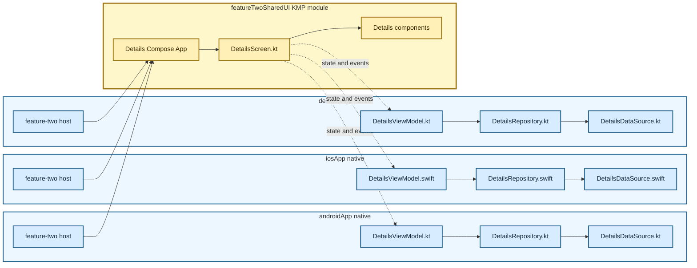

# 12. Modular KMP UI Layer

Feature two shares Compose UI only. Native ViewModels call native repositories and data sources.

```mermaid
flowchart LR
  subgraph Android["androidApp native"]
    AHost["feature-two host"]
    AVM["DetailsViewModel.kt"]
    ARepository["DetailsRepository.kt"]
    ADataSource["DetailsDataSource.kt"]
    AVM --> ARepository --> ADataSource
  end

  subgraph IOS["iosApp native"]
    IHost["feature-two host"]
    IVM["DetailsViewModel.swift"]
    IRepository["DetailsRepository.swift"]
    IDataSource["DetailsDataSource.swift"]
    IVM --> IRepository --> IDataSource
  end

  subgraph Desktop["desktopApp native"]
    DHost["feature-two host"]
    DVM["DetailsViewModel.kt"]
    DRepository["DetailsRepository.kt"]
    DDataSource["DetailsDataSource.kt"]
    DVM --> DRepository --> DDataSource
  end

  subgraph KMP["featureTwoSharedUI KMP module"]
    direction LR
    App["Details Compose App"]
    Screen["DetailsScreen.kt"]
    Components["Details components"]
    App --> Screen --> Components
  end

  AHost --> App
  IHost --> App
  DHost --> App
  Screen -. "state and events" .-> AVM
  Screen -. "state and events" .-> IVM
  Screen -. "state and events" .-> DVM

  classDef app fill:#d8ecff,stroke:#1f5f8b,color:#0f2738,stroke-width:2px;
  classDef kmp fill:#fff0b8,stroke:#9b7415,color:#3b2a00,stroke-width:2px;
  class AHost,AVM,ARepository,ADataSource,IHost,IVM,IRepository,IDataSource,DHost,DVM,DRepository,DDataSource app;
  class App,Screen,Components kmp;
  style Android fill:#edf7ff,stroke:#1f5f8b,stroke-width:2px
  style IOS fill:#edf7ff,stroke:#1f5f8b,stroke-width:2px
  style Desktop fill:#edf7ff,stroke:#1f5f8b,stroke-width:2px
  style KMP fill:#fff7cc,stroke:#9b7415,stroke-width:3px
```
