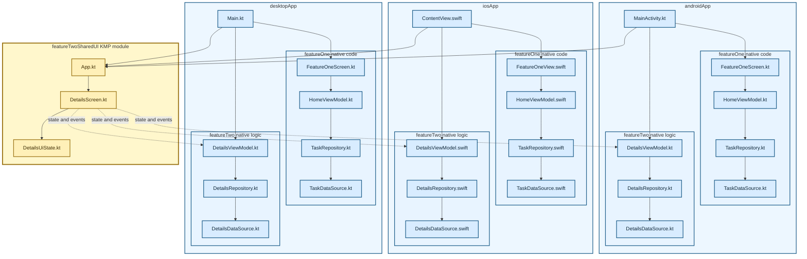

# 12. Modular KMP UI Layer

Feature one stays native inside every platform app. Feature two shares Compose UI only; native ViewModels call native repositories and data sources.

```mermaid
flowchart TB
  subgraph Android["androidApp"]
    direction TB
    AEntry["MainActivity.kt"]
    subgraph AFeatureOne["featureOne native code"]
      direction TB
      AHomeUI["FeatureOneScreen.kt"]
      AHomeVM["HomeViewModel.kt"]
      ATaskRepository["TaskRepository.kt"]
      ATaskDataSource["TaskDataSource.kt"]
      AHomeUI --> AHomeVM --> ATaskRepository --> ATaskDataSource
    end
    subgraph AFeatureTwo["featureTwo native logic"]
      direction TB
      ADetailsVM["DetailsViewModel.kt"]
      ADetailsRepository["DetailsRepository.kt"]
      ADetailsDataSource["DetailsDataSource.kt"]
      ADetailsVM --> ADetailsRepository --> ADetailsDataSource
    end
    AEntry --> AHomeUI
    AEntry --> ADetailsVM
  end

  subgraph IOS["iosApp"]
    direction TB
    IEntry["ContentView.swift"]
    subgraph IFeatureOne["featureOne native code"]
      direction TB
      IHomeUI["FeatureOneView.swift"]
      IHomeVM["HomeViewModel.swift"]
      ITaskRepository["TaskRepository.swift"]
      ITaskDataSource["TaskDataSource.swift"]
      IHomeUI --> IHomeVM --> ITaskRepository --> ITaskDataSource
    end
    subgraph IFeatureTwo["featureTwo native logic"]
      direction TB
      IDetailsVM["DetailsViewModel.swift"]
      IDetailsRepository["DetailsRepository.swift"]
      IDetailsDataSource["DetailsDataSource.swift"]
      IDetailsVM --> IDetailsRepository --> IDetailsDataSource
    end
    IEntry --> IHomeUI
    IEntry --> IDetailsVM
  end

  subgraph Desktop["desktopApp"]
    direction TB
    DEntry["Main.kt"]
    subgraph DFeatureOne["featureOne native code"]
      direction TB
      DHomeUI["FeatureOneScreen.kt"]
      DHomeVM["HomeViewModel.kt"]
      DTaskRepository["TaskRepository.kt"]
      DTaskDataSource["TaskDataSource.kt"]
      DHomeUI --> DHomeVM --> DTaskRepository --> DTaskDataSource
    end
    subgraph DFeatureTwo["featureTwo native logic"]
      direction TB
      DDetailsVM["DetailsViewModel.kt"]
      DDetailsRepository["DetailsRepository.kt"]
      DDetailsDataSource["DetailsDataSource.kt"]
      DDetailsVM --> DDetailsRepository --> DDetailsDataSource
    end
    DEntry --> DHomeUI
    DEntry --> DDetailsVM
  end

  subgraph KMP["featureTwoSharedUI KMP module"]
    direction LR
    App["App.kt"]
    Screen["DetailsScreen.kt"]
    State["DetailsUiState.kt"]
    App --> Screen --> State
  end

  AEntry --> App
  IEntry --> App
  DEntry --> App
  Screen -. "state and events" .-> ADetailsVM
  Screen -. "state and events" .-> IDetailsVM
  Screen -. "state and events" .-> DDetailsVM

  classDef app fill:#d8ecff,stroke:#1f5f8b,color:#0f2738,stroke-width:2px;
  classDef kmp fill:#fff0b8,stroke:#9b7415,color:#3b2a00,stroke-width:2px;
  class AEntry,AHomeUI,AHomeVM,ATaskRepository,ATaskDataSource,ADetailsVM,ADetailsRepository,ADetailsDataSource,IEntry,IHomeUI,IHomeVM,ITaskRepository,ITaskDataSource,IDetailsVM,IDetailsRepository,IDetailsDataSource,DEntry,DHomeUI,DHomeVM,DTaskRepository,DTaskDataSource,DDetailsVM,DDetailsRepository,DDetailsDataSource app;
  class App,Screen,State kmp;
  style Android fill:#edf7ff,stroke:#1f5f8b,stroke-width:2px
  style IOS fill:#edf7ff,stroke:#1f5f8b,stroke-width:2px
  style Desktop fill:#edf7ff,stroke:#1f5f8b,stroke-width:2px
  style AFeatureOne fill:#e8f4ff,stroke:#1f5f8b,stroke-width:2px
  style AFeatureTwo fill:#e8f4ff,stroke:#1f5f8b,stroke-width:2px
  style IFeatureOne fill:#e8f4ff,stroke:#1f5f8b,stroke-width:2px
  style IFeatureTwo fill:#e8f4ff,stroke:#1f5f8b,stroke-width:2px
  style DFeatureOne fill:#e8f4ff,stroke:#1f5f8b,stroke-width:2px
  style DFeatureTwo fill:#e8f4ff,stroke:#1f5f8b,stroke-width:2px
  style KMP fill:#fff7cc,stroke:#9b7415,stroke-width:3px
```
