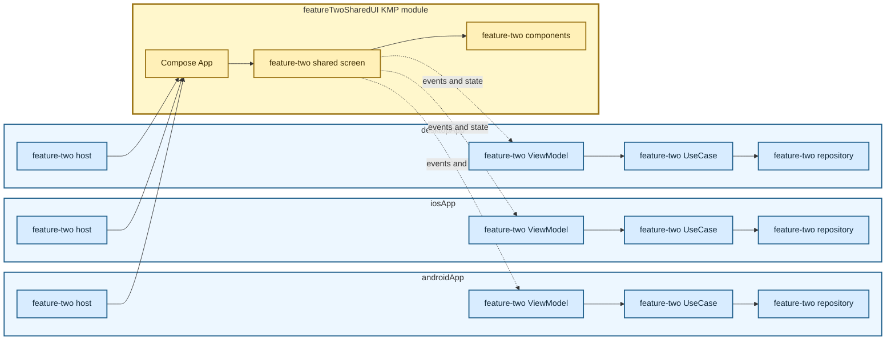

# 12. Modular KMP UI Layer

Feature two shares Compose UI only. Presentation and data stay in app modules.

```mermaid
flowchart LR
  subgraph Android["androidApp"]
    AHost["feature-two host"]
    AVM["feature-two ViewModel"]
    AUseCase["feature-two UseCase"]
    ARepository["feature-two repository"]
    AVM --> AUseCase --> ARepository
  end

  subgraph IOS["iosApp"]
    IHost["feature-two host"]
    IVM["feature-two ViewModel"]
    IUseCase["feature-two UseCase"]
    IRepository["feature-two repository"]
    IVM --> IUseCase --> IRepository
  end

  subgraph Desktop["desktopApp"]
    DHost["feature-two host"]
    DVM["feature-two ViewModel"]
    DUseCase["feature-two UseCase"]
    DRepository["feature-two repository"]
    DVM --> DUseCase --> DRepository
  end

  subgraph KMP["featureTwoSharedUI KMP module"]
    direction LR
    App["Compose App"]
    Screen["feature-two shared screen"]
    Components["feature-two components"]
    App --> Screen --> Components
  end

  AHost --> App
  IHost --> App
  DHost --> App
  Screen -. "events and state" .-> AVM
  Screen -. "events and state" .-> IVM
  Screen -. "events and state" .-> DVM

  classDef app fill:#d8ecff,stroke:#1f5f8b,color:#0f2738,stroke-width:2px;
  classDef kmp fill:#fff0b8,stroke:#9b7415,color:#3b2a00,stroke-width:2px;
  class AHost,AVM,AUseCase,ARepository,IHost,IVM,IUseCase,IRepository,DHost,DVM,DUseCase,DRepository app;
  class App,Screen,Components kmp;
  style Android fill:#edf7ff,stroke:#1f5f8b,stroke-width:2px
  style IOS fill:#edf7ff,stroke:#1f5f8b,stroke-width:2px
  style Desktop fill:#edf7ff,stroke:#1f5f8b,stroke-width:2px
  style KMP fill:#fff7cc,stroke:#9b7415,stroke-width:3px
```
