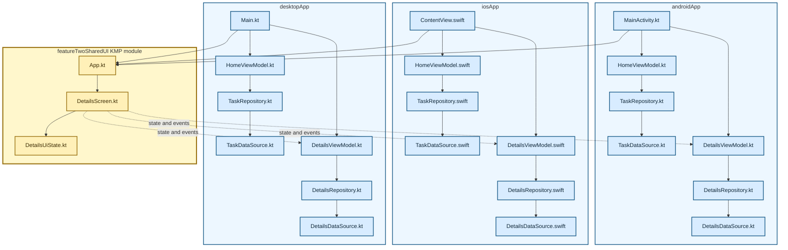

# 12. Modular KMP UI Layer

Feature one stays native in every platform module. Feature two shares Compose UI only; native ViewModels call native repositories and data sources.

```mermaid
flowchart TB
  subgraph Android["androidApp"]
    direction TB
    AEntry["MainActivity.kt"]
    AHomeVM["HomeViewModel.kt"]
    ATaskRepository["TaskRepository.kt"]
    ATaskDataSource["TaskDataSource.kt"]
    ADetailsVM["DetailsViewModel.kt"]
    ADetailsRepository["DetailsRepository.kt"]
    ADetailsDataSource["DetailsDataSource.kt"]
    AEntry --> AHomeVM --> ATaskRepository --> ATaskDataSource
    AEntry --> ADetailsVM --> ADetailsRepository --> ADetailsDataSource
  end

  subgraph IOS["iosApp"]
    direction TB
    IEntry["ContentView.swift"]
    IHomeVM["HomeViewModel.swift"]
    ITaskRepository["TaskRepository.swift"]
    ITaskDataSource["TaskDataSource.swift"]
    IDetailsVM["DetailsViewModel.swift"]
    IDetailsRepository["DetailsRepository.swift"]
    IDetailsDataSource["DetailsDataSource.swift"]
    IEntry --> IHomeVM --> ITaskRepository --> ITaskDataSource
    IEntry --> IDetailsVM --> IDetailsRepository --> IDetailsDataSource
  end

  subgraph Desktop["desktopApp"]
    direction TB
    DEntry["Main.kt"]
    DHomeVM["HomeViewModel.kt"]
    DTaskRepository["TaskRepository.kt"]
    DTaskDataSource["TaskDataSource.kt"]
    DDetailsVM["DetailsViewModel.kt"]
    DDetailsRepository["DetailsRepository.kt"]
    DDetailsDataSource["DetailsDataSource.kt"]
    DEntry --> DHomeVM --> DTaskRepository --> DTaskDataSource
    DEntry --> DDetailsVM --> DDetailsRepository --> DDetailsDataSource
  end

  subgraph KMP["featureTwoSharedUI KMP module"]
    direction LR
    App["App.kt"]
    Screen["DetailsScreen.kt"]
    State["DetailsUiState.kt"]
    App --> Screen --> State
  end

  AEntry --> App
  IEntry --> App
  DEntry --> App
  Screen -. "state and events" .-> ADetailsVM
  Screen -. "state and events" .-> IDetailsVM
  Screen -. "state and events" .-> DDetailsVM

  classDef app fill:#d8ecff,stroke:#1f5f8b,color:#0f2738,stroke-width:2px;
  classDef kmp fill:#fff0b8,stroke:#9b7415,color:#3b2a00,stroke-width:2px;
  class AEntry,AHomeVM,ATaskRepository,ATaskDataSource,ADetailsVM,ADetailsRepository,ADetailsDataSource,IEntry,IHomeVM,ITaskRepository,ITaskDataSource,IDetailsVM,IDetailsRepository,IDetailsDataSource,DEntry,DHomeVM,DTaskRepository,DTaskDataSource,DDetailsVM,DDetailsRepository,DDetailsDataSource app;
  class App,Screen,State kmp;
  style Android fill:#edf7ff,stroke:#1f5f8b,stroke-width:2px
  style IOS fill:#edf7ff,stroke:#1f5f8b,stroke-width:2px
  style Desktop fill:#edf7ff,stroke:#1f5f8b,stroke-width:2px
  style KMP fill:#fff7cc,stroke:#9b7415,stroke-width:3px
```
