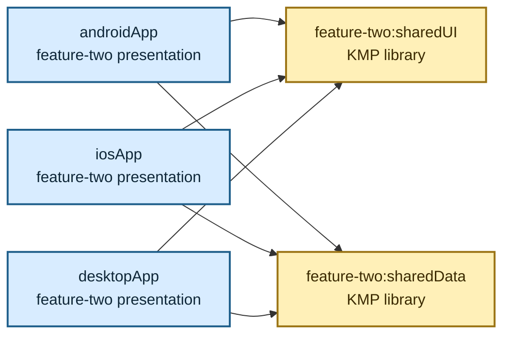

# 13. Modular KMP UI And Data Layers

Feature two shares UI and data as separate KMP modules. Presentation remains platform-specific.

```mermaid
flowchart LR
  SharedF2UI["feature-two:sharedUI\nKMP library"]
  SharedF2Data["feature-two:sharedData\nKMP library"]

  AndroidP["androidApp\nfeature-two presentation"]
  IOSP["iosApp\nfeature-two presentation"]
  DesktopP["desktopApp\nfeature-two presentation"]

  AndroidP --> SharedF2UI
  IOSP --> SharedF2UI
  DesktopP --> SharedF2UI

  AndroidP --> SharedF2Data
  IOSP --> SharedF2Data
  DesktopP --> SharedF2Data

  classDef app fill:#d8ecff,stroke:#1f5f8b,color:#0f2738,stroke-width:2px;
  classDef shared fill:#fff0b8,stroke:#9b7415,color:#3b2a00,stroke-width:2px;
  class AndroidP,IOSP,DesktopP app;
  class SharedF2UI,SharedF2Data shared;
```

