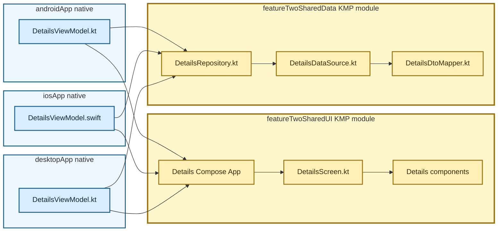

# 13. Modular KMP UI And Data Layers

Feature two shares UI and data as separate KMP modules. Native ViewModels connect the shared UI to the shared data layer.

```mermaid
flowchart LR
  subgraph Android["androidApp native"]
    AVM["DetailsViewModel.kt"]
  end

  subgraph IOS["iosApp native"]
    IVM["DetailsViewModel.swift"]
  end

  subgraph Desktop["desktopApp native"]
    DVM["DetailsViewModel.kt"]
  end

  subgraph UIKMP["featureTwoSharedUI KMP module"]
    direction LR
    App["Details Compose App"]
    Screen["DetailsScreen.kt"]
    Components["Details components"]
    App --> Screen --> Components
  end

  subgraph DataKMP["featureTwoSharedData KMP module"]
    direction LR
    Repository["DetailsRepository.kt"]
    DataSource["DetailsDataSource.kt"]
    Mapper["DetailsDtoMapper.kt"]
    Repository --> DataSource --> Mapper
  end

  AVM --> App
  IVM --> App
  DVM --> App
  AVM --> Repository
  IVM --> Repository
  DVM --> Repository

  classDef app fill:#d8ecff,stroke:#1f5f8b,color:#0f2738,stroke-width:2px;
  classDef kmp fill:#fff0b8,stroke:#9b7415,color:#3b2a00,stroke-width:2px;
  class AVM,IVM,DVM app;
  class App,Screen,Components,Repository,DataSource,Mapper kmp;
  style Android fill:#edf7ff,stroke:#1f5f8b,stroke-width:2px
  style IOS fill:#edf7ff,stroke:#1f5f8b,stroke-width:2px
  style Desktop fill:#edf7ff,stroke:#1f5f8b,stroke-width:2px
  style UIKMP fill:#fff7cc,stroke:#9b7415,stroke-width:3px
  style DataKMP fill:#fff7cc,stroke:#9b7415,stroke-width:3px
```
