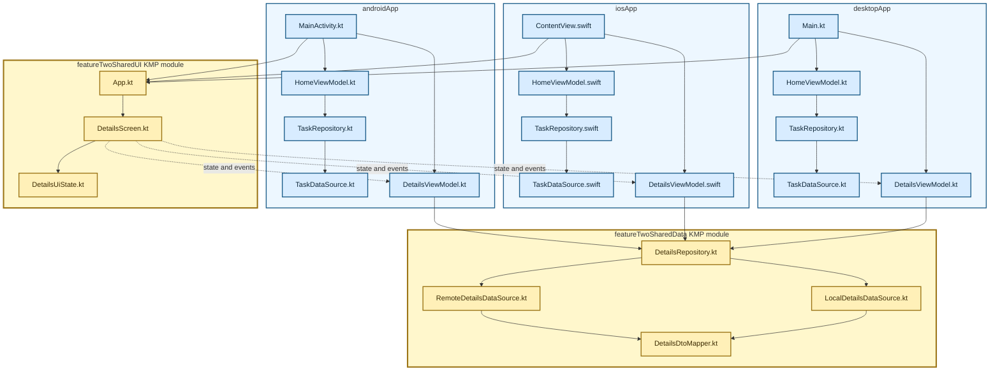

# 13. Modular KMP UI And Data Layers

Feature one stays native in every platform module. Feature two shares UI and data as separate KMP modules; native ViewModels connect the shared UI to shared data.

