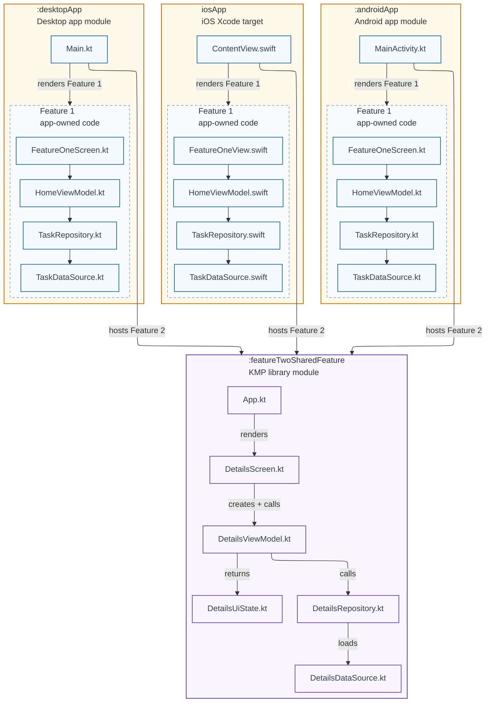

# 14. Modular KMP Shared Feature

Feature one stays native inside every platform app. Feature two is consolidated into one shared KMP feature module.

```mermaid
---
config:
  layout: elk
  elk:
    nodePlacementStrategy: BRANDES_KOEPF
---
flowchart TB
  subgraph Android[":androidApp\nAndroid app module"]
    direction TB
    AEntry["MainActivity.kt"]
    subgraph AFeatureOne["Feature 1\napp-owned code"]
      direction TB
      AHomeUI["FeatureOneScreen.kt"]
      AHomeVM["HomeViewModel.kt"]
      ATaskRepository["TaskRepository.kt"]
      ATaskDataSource["TaskDataSource.kt"]
      AHomeUI --> AHomeVM --> ATaskRepository --> ATaskDataSource
    end
    AEntry -->|"renders Feature 1"| AFeatureOne
  end

  subgraph IOS["iosApp\niOS Xcode target"]
    direction TB
    IEntry["ContentView.swift"]
    subgraph IFeatureOne["Feature 1\napp-owned code"]
      direction TB
      IHomeUI["FeatureOneView.swift"]
      IHomeVM["HomeViewModel.swift"]
      ITaskRepository["TaskRepository.swift"]
      ITaskDataSource["TaskDataSource.swift"]
      IHomeUI --> IHomeVM --> ITaskRepository --> ITaskDataSource
    end
    IEntry -->|"renders Feature 1"| IFeatureOne
  end

  subgraph Desktop[":desktopApp\nDesktop app module"]
    direction TB
    DEntry["Main.kt"]
    subgraph DFeatureOne["Feature 1\napp-owned code"]
      direction TB
      DHomeUI["FeatureOneScreen.kt"]
      DHomeVM["HomeViewModel.kt"]
      DTaskRepository["TaskRepository.kt"]
      DTaskDataSource["TaskDataSource.kt"]
      DHomeUI --> DHomeVM --> DTaskRepository --> DTaskDataSource
    end
    DEntry -->|"renders Feature 1"| DFeatureOne
  end

  subgraph KMP[":featureTwoSharedFeature\nKMP library module"]
    direction TB
    App["App.kt"]
    Screen["DetailsScreen.kt"]
    State["DetailsUiState.kt"]
    VM["DetailsViewModel.kt"]
    Repository["DetailsRepository.kt"]
    DataSource["DetailsDataSource.kt"]
    App -->|"renders"| Screen
    Screen -->|"creates + calls"| VM
    VM -->|"calls"| Repository
    Repository -->|"loads"| DataSource
    VM -->|"returns"| State
  end

  DEntry -->|"hosts Feature 2"| KMP
  IEntry -->|"hosts Feature 2"| KMP
  AEntry -->|"hosts Feature 2"| KMP

  classDef app fill:#f3f9fc,stroke:#2b6f9e,color:#334155,stroke-width:1.4px;
  classDef kmp fill:#f8f5fe,stroke:#6e4bae,color:#334155,stroke-width:1.4px;
  class AEntry,AHomeUI,AHomeVM,ATaskRepository,ATaskDataSource,IEntry,IHomeUI,IHomeVM,ITaskRepository,ITaskDataSource,DEntry,DHomeUI,DHomeVM,DTaskRepository,DTaskDataSource app;
  class App,Screen,State,VM,Repository,DataSource kmp;
  style Android fill:#fff8eb,stroke:#c47a12,stroke-width:1.6px
  style IOS fill:#fff8eb,stroke:#c47a12,stroke-width:1.6px
  style Desktop fill:#fff8eb,stroke:#c47a12,stroke-width:1.6px
  style AFeatureOne fill:#f8fbfd,stroke:#8aa7bc,stroke-width:1.2px,stroke-dasharray:5 4
  style IFeatureOne fill:#f8fbfd,stroke:#8aa7bc,stroke-width:1.2px,stroke-dasharray:5 4
  style DFeatureOne fill:#f8fbfd,stroke:#8aa7bc,stroke-width:1.2px,stroke-dasharray:5 4
  style KMP fill:#f8f5fe,stroke:#6e4bae,stroke-width:1.6px
```
