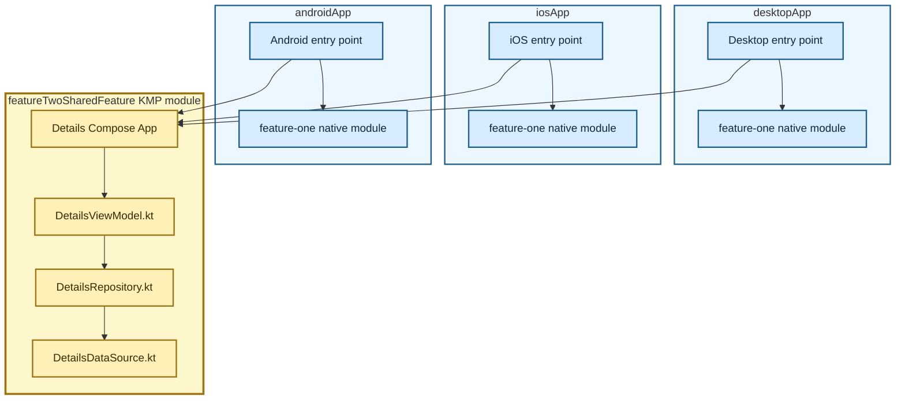

# 14. Modular KMP Shared Feature

Feature two is consolidated into one shared KMP feature module. Feature one remains native in each app target.

```mermaid
flowchart TB
  subgraph Desktop["desktopApp"]
    DEntry["Desktop entry point"]
    DFeatureOne["feature-one native module"]
    DEntry --> DFeatureOne
  end

  subgraph IOS["iosApp"]
    IEntry["iOS entry point"]
    IFeatureOne["feature-one native module"]
    IEntry --> IFeatureOne
  end

  subgraph Android["androidApp"]
    AEntry["Android entry point"]
    AFeatureOne["feature-one native module"]
    AEntry --> AFeatureOne
  end

  subgraph KMP["featureTwoSharedFeature KMP module"]
    direction LR
    App["Details Compose App"]
    VM["DetailsViewModel.kt"]
    Repository["DetailsRepository.kt"]
    DataSource["DetailsDataSource.kt"]
    App --> VM --> Repository --> DataSource
  end

  AEntry --> App
  IEntry --> App
  DEntry --> App

  classDef app fill:#d8ecff,stroke:#1f5f8b,color:#0f2738,stroke-width:2px;
  classDef kmp fill:#fff0b8,stroke:#9b7415,color:#3b2a00,stroke-width:2px;
  class AEntry,AFeatureOne,IEntry,IFeatureOne,DEntry,DFeatureOne app;
  class App,VM,Repository,DataSource kmp;
  style Android fill:#edf7ff,stroke:#1f5f8b,stroke-width:2px
  style IOS fill:#edf7ff,stroke:#1f5f8b,stroke-width:2px
  style Desktop fill:#edf7ff,stroke:#1f5f8b,stroke-width:2px
  style KMP fill:#fff7cc,stroke:#9b7415,stroke-width:3px
```
