# 14. Modular KMP Shared Feature

Feature one stays native inside every platform app. Feature two is consolidated into one shared KMP feature module.

[Full SVG](images/14-modular-kmp-shared-feature.svg) · [PNG @2x](images/14-modular-kmp-shared-feature@2x.png) · [Preview PNG @2x](previews/14-modular-kmp-shared-feature@2x.png)

[Diagram specification](specs/14-modular-kmp-shared-feature.json) · [Runnable sample](../samples/14_modular-kmp-shared-feature/)
