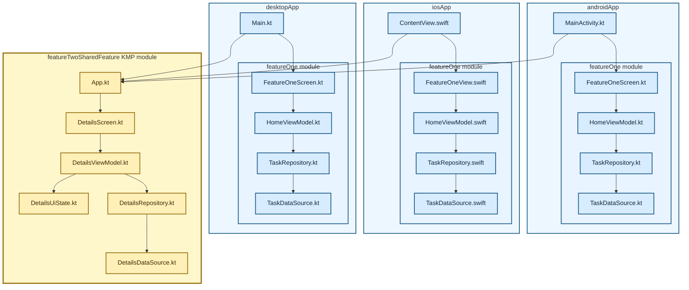

# 14. Modular KMP Shared Feature

Feature one stays native in every platform module. Feature two is consolidated into one shared KMP feature module.

```mermaid
flowchart TB
  subgraph Android["androidApp"]
    direction TB
    AEntry["MainActivity.kt"]
    subgraph AFeatureOne["featureOne module"]
      direction TB
      AHomeUI["FeatureOneScreen.kt"]
      AHomeVM["HomeViewModel.kt"]
      ATaskRepository["TaskRepository.kt"]
      ATaskDataSource["TaskDataSource.kt"]
      AHomeUI --> AHomeVM --> ATaskRepository --> ATaskDataSource
    end
    AEntry --> AHomeUI
  end

  subgraph IOS["iosApp"]
    direction TB
    IEntry["ContentView.swift"]
    subgraph IFeatureOne["featureOne module"]
      direction TB
      IHomeUI["FeatureOneView.swift"]
      IHomeVM["HomeViewModel.swift"]
      ITaskRepository["TaskRepository.swift"]
      ITaskDataSource["TaskDataSource.swift"]
      IHomeUI --> IHomeVM --> ITaskRepository --> ITaskDataSource
    end
    IEntry --> IHomeUI
  end

  subgraph Desktop["desktopApp"]
    direction TB
    DEntry["Main.kt"]
    subgraph DFeatureOne["featureOne module"]
      direction TB
      DHomeUI["FeatureOneScreen.kt"]
      DHomeVM["HomeViewModel.kt"]
      DTaskRepository["TaskRepository.kt"]
      DTaskDataSource["TaskDataSource.kt"]
      DHomeUI --> DHomeVM --> DTaskRepository --> DTaskDataSource
    end
    DEntry --> DHomeUI
  end

  subgraph KMP["featureTwoSharedFeature KMP module"]
    direction LR
    App["App.kt"]
    Screen["DetailsScreen.kt"]
    State["DetailsUiState.kt"]
    VM["DetailsViewModel.kt"]
    Repository["DetailsRepository.kt"]
    DataSource["DetailsDataSource.kt"]
    App --> Screen --> VM --> Repository --> DataSource
    VM --> State
  end

  AEntry --> App
  IEntry --> App
  DEntry --> App

  classDef app fill:#d8ecff,stroke:#1f5f8b,color:#0f2738,stroke-width:2px;
  classDef kmp fill:#fff0b8,stroke:#9b7415,color:#3b2a00,stroke-width:2px;
  class AEntry,AHomeUI,AHomeVM,ATaskRepository,ATaskDataSource,IEntry,IHomeUI,IHomeVM,ITaskRepository,ITaskDataSource,DEntry,DHomeUI,DHomeVM,DTaskRepository,DTaskDataSource app;
  class App,Screen,State,VM,Repository,DataSource kmp;
  style Android fill:#edf7ff,stroke:#1f5f8b,stroke-width:2px
  style IOS fill:#edf7ff,stroke:#1f5f8b,stroke-width:2px
  style Desktop fill:#edf7ff,stroke:#1f5f8b,stroke-width:2px
  style AFeatureOne fill:#e8f4ff,stroke:#1f5f8b,stroke-width:2px
  style IFeatureOne fill:#e8f4ff,stroke:#1f5f8b,stroke-width:2px
  style DFeatureOne fill:#e8f4ff,stroke:#1f5f8b,stroke-width:2px
  style KMP fill:#fff7cc,stroke:#9b7415,stroke-width:3px
```
