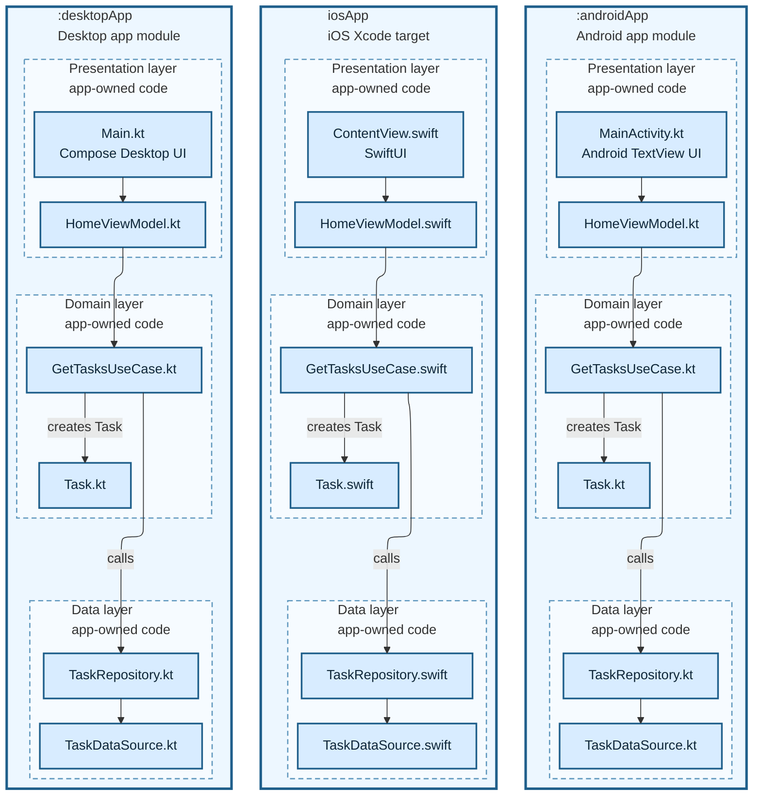

# 15. Three Layer Native

Baseline three-layer native architecture. Each app target owns presentation, domain, and data layers. These layers are app-owned code groupings, not separate build modules.

