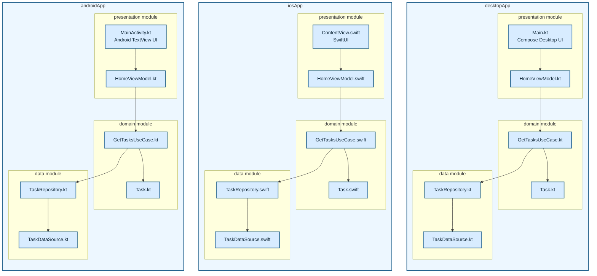

# 15. Three Layer Native

Baseline three-layer native architecture. Each app target has presentation, domain, and data modules. Presentation contains UI and ViewModel.

```mermaid
flowchart TB
  subgraph Desktop["desktopApp"]
    direction TB
    subgraph DPresentation["presentation module"]
      DUI["Main.kt\nCompose Desktop UI"]
      DVM["HomeViewModel.kt"]
      DUI --> DVM
    end
    subgraph DDomain["domain module"]
      DUseCase["GetTasksUseCase.kt"]
      DEntity["Task.kt"]
      DUseCase --> DEntity
    end
    subgraph DData["data module"]
      DRepository["TaskRepository.kt"]
      DDataSource["TaskDataSource.kt"]
      DRepository --> DDataSource
    end
    DVM --> DUseCase --> DRepository
  end

  subgraph IOS["iosApp"]
    direction TB
    subgraph IPresentation["presentation module"]
      IUI["ContentView.swift\nSwiftUI"]
      IVM["HomeViewModel.swift"]
      IUI --> IVM
    end
    subgraph IDomain["domain module"]
      IUseCase["GetTasksUseCase.swift"]
      IEntity["Task.swift"]
      IUseCase --> IEntity
    end
    subgraph IData["data module"]
      IRepository["TaskRepository.swift"]
      IDataSource["TaskDataSource.swift"]
      IRepository --> IDataSource
    end
    IVM --> IUseCase --> IRepository
  end

  subgraph Android["androidApp"]
    direction TB
    subgraph APresentation["presentation module"]
      AUI["MainActivity.kt\nAndroid TextView UI"]
      AVM["HomeViewModel.kt"]
      AUI --> AVM
    end
    subgraph ADomain["domain module"]
      AUseCase["GetTasksUseCase.kt"]
      AEntity["Task.kt"]
      AUseCase --> AEntity
    end
    subgraph AData["data module"]
      ARepository["TaskRepository.kt"]
      ADataSource["TaskDataSource.kt"]
      ARepository --> ADataSource
    end
    AVM --> AUseCase --> ARepository
  end

  classDef native fill:#d8ecff,stroke:#1f5f8b,color:#0f2738,stroke-width:2px;
  class AUI,AVM,AUseCase,AEntity,ARepository,ADataSource,IUI,IVM,IUseCase,IEntity,IRepository,IDataSource,DUI,DVM,DUseCase,DEntity,DRepository,DDataSource native;
  style Android fill:#edf7ff,stroke:#1f5f8b,stroke-width:2px
  style IOS fill:#edf7ff,stroke:#1f5f8b,stroke-width:2px
  style Desktop fill:#edf7ff,stroke:#1f5f8b,stroke-width:2px
```
