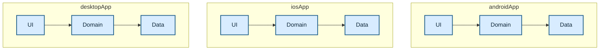

# 15. Three Layer Native

Baseline three-layer architecture with platform-specific UI, domain, and data.

```mermaid
flowchart TB
  subgraph Android["androidApp"]
    AUI["UI"]
    ADomain["Domain"]
    AData["Data"]
    AUI --> ADomain --> AData
  end

  subgraph IOS["iosApp"]
    IUI["UI"]
    IDomain["Domain"]
    IData["Data"]
    IUI --> IDomain --> IData
  end

  subgraph Desktop["desktopApp"]
    DUI["UI"]
    DDomain["Domain"]
    DData["Data"]
    DUI --> DDomain --> DData
  end

  classDef layer fill:#d8ecff,stroke:#1f5f8b,color:#0f2738,stroke-width:2px;
  class AUI,ADomain,AData,IUI,IDomain,IData,DUI,DDomain,DData layer;
```

