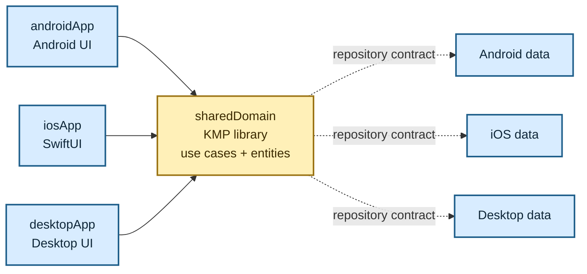

# 16. Three Layer KMP Domain

The domain layer is shared. UI and data stay platform-specific.

```mermaid
flowchart LR
  SharedDomain["sharedDomain\nKMP library\nuse cases + entities"]

  AndroidUI["androidApp\nAndroid UI"]
  IOSUI["iosApp\nSwiftUI"]
  DesktopUI["desktopApp\nDesktop UI"]

  AndroidData["Android data"]
  IOSData["iOS data"]
  DesktopData["Desktop data"]

  AndroidUI --> SharedDomain
  IOSUI --> SharedDomain
  DesktopUI --> SharedDomain

  SharedDomain -. "repository contract" .-> AndroidData
  SharedDomain -. "repository contract" .-> IOSData
  SharedDomain -. "repository contract" .-> DesktopData

  classDef app fill:#d8ecff,stroke:#1f5f8b,color:#0f2738,stroke-width:2px;
  classDef shared fill:#fff0b8,stroke:#9b7415,color:#3b2a00,stroke-width:2px;
  class AndroidUI,IOSUI,DesktopUI,AndroidData,IOSData,DesktopData app;
  class SharedDomain shared;
```

