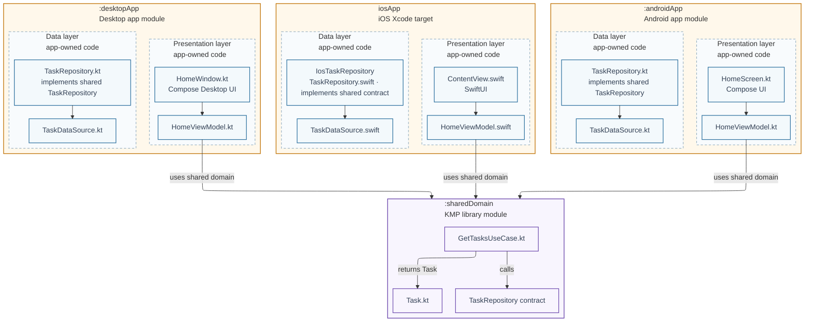

# 16. Three Layer KMP Domain

The domain layer is shared. Presentation and data remain app-owned layers; presentation contains UI plus ViewModel.

```mermaid
---
config:
  layout: elk
  elk:
    nodePlacementStrategy: BRANDES_KOEPF
---
flowchart TB
  subgraph Android[":androidApp\nAndroid app module"]
    direction TB
    subgraph APresentation["Presentation layer\napp-owned code"]
      direction TB
      AUI["HomeScreen.kt\nCompose UI"]
      AVM["HomeViewModel.kt"]
      AUI --> AVM
    end
    subgraph AData["Data layer\napp-owned code"]
      direction TB
      ARepository["TaskRepository.kt\nimplements shared TaskRepository"]
      ADataSource["TaskDataSource.kt"]
      ARepository --> ADataSource
    end
  end

  subgraph IOS["iosApp\niOS Xcode target"]
    direction TB
    subgraph IPresentation["Presentation layer\napp-owned code"]
      direction TB
      IUI["ContentView.swift\nSwiftUI"]
      IVM["HomeViewModel.swift"]
      IUI --> IVM
    end
    subgraph IData["Data layer\napp-owned code"]
      direction TB
      IRepository["IosTaskRepository\nTaskRepository.swift · implements shared contract"]
      IDataSource["TaskDataSource.swift"]
      IRepository --> IDataSource
    end
  end

  subgraph Desktop[":desktopApp\nDesktop app module"]
    direction TB
    subgraph DPresentation["Presentation layer\napp-owned code"]
      direction TB
      DUI["HomeWindow.kt\nCompose Desktop UI"]
      DVM["HomeViewModel.kt"]
      DUI --> DVM
    end
    subgraph DData["Data layer\napp-owned code"]
      direction TB
      DRepository["TaskRepository.kt\nimplements shared TaskRepository"]
      DDataSource["TaskDataSource.kt"]
      DRepository --> DDataSource
    end
  end

  subgraph KMP[":sharedDomain\nKMP library module"]
    direction TB
    UseCase["GetTasksUseCase.kt"]
    Entity["Task.kt"]
    RepositoryPort["TaskRepository contract"]
    UseCase -->|"returns Task"| Entity
    UseCase -->|"calls"| RepositoryPort
  end

  DVM -->|"uses shared domain"| KMP
  IVM -->|"uses shared domain"| KMP
  AVM -->|"uses shared domain"| KMP

  classDef app fill:#f3f9fc,stroke:#2b6f9e,color:#334155,stroke-width:1.4px;
  classDef kmp fill:#f8f5fe,stroke:#6e4bae,color:#334155,stroke-width:1.4px;
  class AUI,AVM,ARepository,ADataSource,IUI,IVM,IRepository,IDataSource,DUI,DVM,DRepository,DDataSource app;
  class UseCase,Entity,RepositoryPort kmp;
  style Android fill:#fff8eb,stroke:#c47a12,stroke-width:1.6px
  style IOS fill:#fff8eb,stroke:#c47a12,stroke-width:1.6px
  style Desktop fill:#fff8eb,stroke:#c47a12,stroke-width:1.6px
  style APresentation fill:#f8fbfd,stroke:#8aa7bc,stroke-width:1.2px,stroke-dasharray:5 4
  style AData fill:#f8fbfd,stroke:#8aa7bc,stroke-width:1.2px,stroke-dasharray:5 4
  style IPresentation fill:#f8fbfd,stroke:#8aa7bc,stroke-width:1.2px,stroke-dasharray:5 4
  style IData fill:#f8fbfd,stroke:#8aa7bc,stroke-width:1.2px,stroke-dasharray:5 4
  style DPresentation fill:#f8fbfd,stroke:#8aa7bc,stroke-width:1.2px,stroke-dasharray:5 4
  style DData fill:#f8fbfd,stroke:#8aa7bc,stroke-width:1.2px,stroke-dasharray:5 4
  style KMP fill:#f8f5fe,stroke:#6e4bae,stroke-width:1.6px
```
