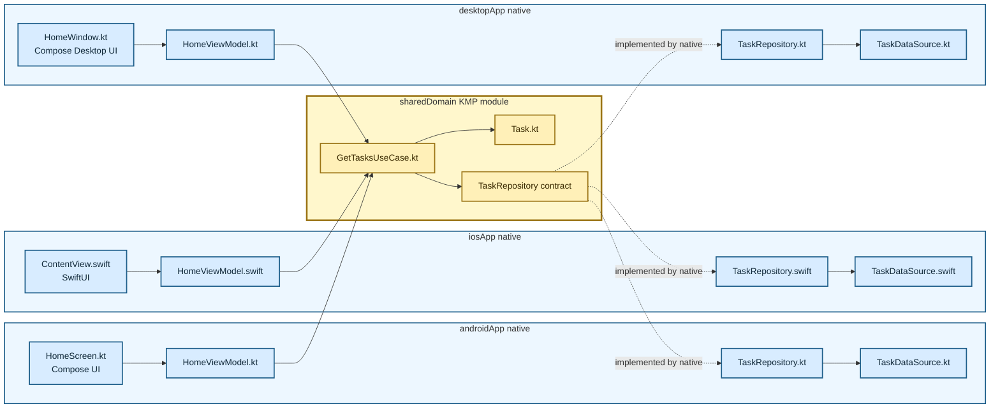

# 16. Three Layer KMP Domain

The domain layer is shared. Presentation stays native and contains UI plus ViewModel; data implementations stay native.

```mermaid
flowchart LR
  subgraph Android["androidApp native"]
    AUI["HomeScreen.kt\nCompose UI"]
    AVM["HomeViewModel.kt"]
    ARepository["TaskRepository.kt"]
    ADataSource["TaskDataSource.kt"]
    AUI --> AVM
    ARepository --> ADataSource
  end

  subgraph IOS["iosApp native"]
    IUI["ContentView.swift\nSwiftUI"]
    IVM["HomeViewModel.swift"]
    IRepository["TaskRepository.swift"]
    IDataSource["TaskDataSource.swift"]
    IUI --> IVM
    IRepository --> IDataSource
  end

  subgraph Desktop["desktopApp native"]
    DUI["HomeWindow.kt\nCompose Desktop UI"]
    DVM["HomeViewModel.kt"]
    DRepository["TaskRepository.kt"]
    DDataSource["TaskDataSource.kt"]
    DUI --> DVM
    DRepository --> DDataSource
  end

  subgraph KMP["sharedDomain KMP module"]
    direction LR
    UseCase["GetTasksUseCase.kt"]
    Entity["Task.kt"]
    RepositoryPort["TaskRepository contract"]
    UseCase --> Entity
    UseCase --> RepositoryPort
  end

  AVM --> UseCase
  IVM --> UseCase
  DVM --> UseCase
  RepositoryPort -. "implemented by native" .-> ARepository
  RepositoryPort -. "implemented by native" .-> IRepository
  RepositoryPort -. "implemented by native" .-> DRepository

  classDef app fill:#d8ecff,stroke:#1f5f8b,color:#0f2738,stroke-width:2px;
  classDef kmp fill:#fff0b8,stroke:#9b7415,color:#3b2a00,stroke-width:2px;
  class AUI,AVM,ARepository,ADataSource,IUI,IVM,IRepository,IDataSource,DUI,DVM,DRepository,DDataSource app;
  class UseCase,Entity,RepositoryPort kmp;
  style Android fill:#edf7ff,stroke:#1f5f8b,stroke-width:2px
  style IOS fill:#edf7ff,stroke:#1f5f8b,stroke-width:2px
  style Desktop fill:#edf7ff,stroke:#1f5f8b,stroke-width:2px
  style KMP fill:#fff7cc,stroke:#9b7415,stroke-width:3px
```
