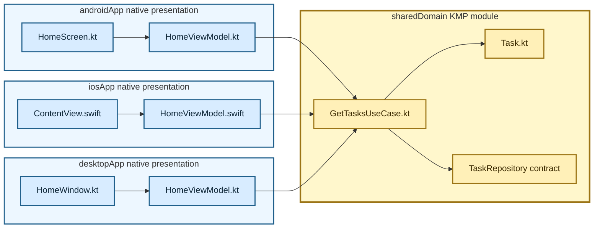

# 17. Three Layer KMP Domain Simple

Simplified domain-sharing view. Native presentation calls into one shared domain KMP module.

```mermaid
flowchart LR
  subgraph Android["androidApp native presentation"]
    AUI["HomeScreen.kt"]
    AVM["HomeViewModel.kt"]
    AUI --> AVM
  end

  subgraph IOS["iosApp native presentation"]
    IUI["ContentView.swift"]
    IVM["HomeViewModel.swift"]
    IUI --> IVM
  end

  subgraph Desktop["desktopApp native presentation"]
    DUI["HomeWindow.kt"]
    DVM["HomeViewModel.kt"]
    DUI --> DVM
  end

  subgraph KMP["sharedDomain KMP module"]
    direction LR
    UseCase["GetTasksUseCase.kt"]
    Entity["Task.kt"]
    RepositoryPort["TaskRepository contract"]
    UseCase --> Entity
    UseCase --> RepositoryPort
  end

  AVM --> UseCase
  IVM --> UseCase
  DVM --> UseCase

  classDef app fill:#d8ecff,stroke:#1f5f8b,color:#0f2738,stroke-width:2px;
  classDef kmp fill:#fff0b8,stroke:#9b7415,color:#3b2a00,stroke-width:2px;
  class AUI,AVM,IUI,IVM,DUI,DVM app;
  class UseCase,Entity,RepositoryPort kmp;
  style Android fill:#edf7ff,stroke:#1f5f8b,stroke-width:2px
  style IOS fill:#edf7ff,stroke:#1f5f8b,stroke-width:2px
  style Desktop fill:#edf7ff,stroke:#1f5f8b,stroke-width:2px
  style KMP fill:#fff7cc,stroke:#9b7415,stroke-width:3px
```
